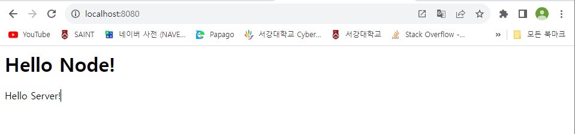

# Node.js 교과서 4장 요약
## *http 모듈로 서버 만들기*
- - -

## 4.1 요청과 응답 이해하기


서버는 클라이언트가 있기에 동작한다. 클라이언트는 서버로 **요청(request)** 을 보내고, 서버는 요청의 내용을 읽고 처리한 뒤 클라이언트에게 **응답(response)** 을 보낸다.

따라서 서버엔 요청을 받는 부분과 응답을 보내는 부분이 있어야 한다. 요청과 응답은 이벤트 방식으로 여겨질 수 있다. 클라이언트로부터 요청이 왔을 때 어떤 작업을 수행할지 이벤트 리스너를 미리 등록해 두어야 한다.

**createServer.js**
```
const http = require("http");

http.createServer((req, res) => {
    // 여기에 어떻게 응답할지 기술한다.
});
```

위 코드는 이벤트 리스너를 가진 노드 서버를 만들기 위한 템플릿 코드이다.

`http` 모듈을 사용하여 웹 브라우저의 요청을 처리할 수 있는 http 서버를 생성했다. `createServer` 메소드를 사용하여 인수로 요청에 대한 콜백 함수를 전달할 수 있으며, 요청이 들어올 때마다 매번 콜백 함수가 실행된다. 따라서 이 콜백 함수에 요청에 대한 응답을 기술하면 된다.

다음 예제로 응답을 보내는 부분과 서버 연결 부분을 추가한다.

**server1.js**
```
const http = require("http");

http.createServer((req, res) => {
    res.writeHead(200, { "Content-type": "text/html; charset=utf-8" });
    res.write("<h1>Hello Node!</h1>");
    res.end("<p>Hello Server!</p>");
})
    .listen(8080, () => {   // 서버 연결
        console.log("8080번 포트에서 서버 대기 중입니다.");
    });
```

**console**
```
PS D:\공부\Javascript\Study_Node.js\Codes\chapter04> node server1
8080번 포트에서 서버 대기 중입니다.
```



브라우저를 실행하고 **http://localhost:8080/** 에 접속하면 위와 같은 화면이 나타난다. `Ctrl`+`C`를 입력하여 서버를 종료할 수 있다.

`createServer` 메소드 안에는 요청에 대한 응답을 정의하고, 메소드 뒤에는 `listen` 메소드를 붙여 그 안에 클라이언트에게 공개할 포트 번호와 포트 연결 후 실행될 콜백 함수를 전달한다. 프로그램을 실행하면 서버는 8080번 포트에서 요청을 기다린다.

`res` 객체에는 `res.writeHead`, `res.write`, `res.end` 메소드가 있다.

`res.writeHead`는 응답에 대한 정보를 기록하는 메소드이다. 첫 번째 인수로는 성공적인 요청임을 의미하는 `200`을, 두 번째 인수로는 응답에 대한 정보를 보낸다. 코드에서는 두 번째 인수에서 콘텐츠의 형식이 HTML임을 알리고 있다. 또한, 한글 표시를 위해 charset을 utf-8로 지정했다. 이러한 정보가 기록되는 부분을 `헤더(header)`라고 한다.

`res.write`의 첫 번째 인수는 클라이언트로 보낼 데이터이다. 예제에서는 HTML 모양의 문자열을 보냈지만 버퍼를 보낼 수도 있다. 또한, 여러 번 호출해서 데이터를 여러 개 보내도 된다. 데이터가 기록되는 부분을 `본문(body)`이라고 한다.

`res.end`는 응답을 종료한다. 만약 인수가 있다면 그 데이터까지 클라이언트로 보낸다. 브라우저는 응답 내용을 받아서 렌더링한다.

`listen` 메소드에 콜백 함수를 넣는 대신 다음 예제와 같이 서버에 `listening` 이벤트 리스너를 등록해도 된다. 추가로 `error` 이벤트 리스너도 등록하였다.

**server1-1.js**
```
const http = require("http");

const server = http.createServer((req, res) => {
    res.writeHead(200, { "Content-Type": "text/html; charset=utf-8" });
    res.write("<h1>Hello Node!</h1>");
    res.end("<p>Hello Server!</p>");
});

server.listen(8080);

server.on("listening", () => {
    console.log("8080번 포트에서 서버 대기 중입니다.");
});

server.on("error", (error) => {
    console.error(error);
});
```

다음과 같이 한 번에 여러 개의 서버를 실행할 수도 있다. `createServer`를 원하는 만큼 호출하면 된다.

**server1-2.js**
```
const http = require("http");

http.createServer((req, res) => {
    res.writeHead(200, { "Content-Type": "text/html; charset=utf-8" });
    res.write("<h1>Hello Node!</h1>");
    res.end("<p>Hello Server!</p>");
})
    .listen(8080, () => {
        console.log("8080번 포트에서 서버 대기 중입니다.");
    });

http.createServer((req, res) => {
    res.writeHead(200, { "Content-Type": "text/html; charset=utf-8" });
    res.write("<h1>Hello Node!</h1>");
    res.end("<p>Hello Server!</p>");
})
    .listen(8081, () => {
        console.log("8081번 포트에서 서버 대기 중입니다.");
    });    
```

이때 포트 번호는 반드시 달라야 한다. 포트 번호가 같을 시엔 `EADDRINUSE` 에러가 발생한다. 단, 실무에서 이런 식으로 서버를 여러 개 띄우는 일은 드물다.

`res.write`와 `res.end`에 일일이 HTML 코드를 적는 것은 비효율적이므로 미리 HTML 파일을 만들어 두고, `fs` 모듈을 사용하여 전송하는 것이 바람직하다. 다음 예제를 통해 HTML 파일을 전송하는 방법을 알아본다.

**server2.html**
```
<!DOCTYPE html>
<html lang="en">
<head>
    <meta charset="UTF-8">
    <meta name="viewport" content="width=device-width, initial-scale=1.0">
    <title>Node.js 웹 서버</title>
</head>
<body>
    <h1>Node.js 웹 서버</h1>
    <p>테스트 코드입니다.</p>
</body>
</html>
```

**server2.js**
```
const http = require("http");
const fs = require("fs").promises;

http.createServer(async (req, res) => {
    try {
        const data = await fs.readFile("./html/server2.html");
        res.end(data);
    } catch (err) {
        console.error(err);
        res.writeHead(500, { "Content-Type": "text/plain; charset=utf-8" });
        res.end(err.message);
    }
})
    .listen(8081, () => {
        console.log("8081번 포트에서 서버 대기 중입니다.");
    });
```


요청이 들어올 시 먼저 `fs` 모듈로 HTML 파일을 읽는다. `data` 변수에 저장된 버퍼를 그대로 클라이언트에 보내면 된다. 이전 예제들에서는 문자열을 보냈지만 버퍼를 직접 보낼 수도 있다. 에러 메시지를 출력할 때는 일반 문자열이므로 `text/plain`을 사용했다.

**HTTP 상태 코드**: 200이나 500과 같은 숫자는 HTTP 상태 코드라고 부른다. `res.writeHead`의 첫 번째 인수로 상태 코드를 넣었는데, 브라우저는 서버에서 보내주는 상태 코드를 보고 요청이 성공했는지 실패했는지를 판단한다.

- **2XX**: 성공을 알리는 상태 코드이다. 200(성공), 201(작성됨)이 많이 사용된다.
- **3XX**: 리다이렉션을 알리는 상태 코드이다. 어떤 주소를 입력했는데 다른 주소의 페이지로 넘어갈 때 이 코드가 사용된다. 대표적으로 301(영구 이동), 302(임시 이동)가 있다. 304(수정되지 않음)는 요청의 응답으로 캐시를 사용했다는 뜻이다.
- **4XX**: 요청 오류를 나타낸다. 요청 자체에 오류가 있을 때 표시된다. 대표적으로 400(잘못된 요청), 401(권한 없음), 403(금지됨), 404(찾을 수 없음)가 있다.
- **5XX**: 서버 오류를 나타낸다. 요청은 제대로 받았지만 서버에 오류가 생겼을 때 발생한다. 이 오류를 `res.writeHead`를 이용하여 클라이언트에 직접 보내는 경우는 거의 없고, 예기치 못한 에러가 발생하면 서버가 알아서 5XX대 코드를 보낸다. 500(내부 서버 오류), 502(불량 게이트웨이), 503(서비스를 사용할 수 없음)이 자주 사용된다.

>요청 처리 중에 에러가 발생했다고 해서 응답을 보내지 않으면 안 된다. 응답을 무조건 클라이언트로 보내서 요청이 마무리되었음을 알려야 한다. 아니면 클라이언트는 일정 시간 기다리다가 Timeout(시간 초과) 처리한다.

지금까지는 모든 요청에 대해 한 가지 응답밖에 할 수 없는 경우를 살펴보았다. 다음 절에서는 요청별로 다른 응답을 하는 방법을 알아본다.
- - -

## 4.2 REST와 라우팅 사용하기

서버에 요청을 보낼 때는 주소를 통해 요청의 내용을 표현한다. 예를 들어 `/index.html`은 서버의 index.html이라는 파일을 보내달라는 의미이고, `/about.html`이면 서버의 about.html이라는 파일을 보내달라는 의미이다.

그러나 항상 html 파일만 요청할 필요는 없다. css나 js 또는 이미지 파일 등을 요청할 수도 있고, 어떤 동작을 행하라고 요청할 수도 있다. 요청의 내용이 주소를 통해 표현되므로 서버가 이해하기 쉬운 주소를 사용하는 것이 좋다. 여기서 `REST`라는 개념이 등장한다. 주소는 의미를 명확히 전달하기 위해 명사로 구성된다. `/user`라면 사용자 정보에 관련된 자원을, `/post`라면 게시글과 관련된 자원을 요청하는 것이라고 추측할 수 있다.

`REST(Representational State Transfer)`: 서버의 자원을 정의하고 자원에 대한 주소를 지정하는 방법을 가리킨다. 자원이란 꼭 파일만을 의미하지 않고, 서버가 행할 수 있는 모든 것들을 통틀어 의미한다.

**요청 메소드**
- `GET`: 서버 자원을 가져오고자 할 때 사용한다. **요청의 본문(body)에 데이터를 넣지 않는다.** 데이터를 서버로 보내야 한다면 쿼리스트링을 사용한다.
- `POST`: 서버에 자원을 새로 등록하고자 할 때 사용한다. **요청의 본문에 새로 등록할 데이터를 넣어 보낸다.**
- `PUT`: 서버의 자원을 요청에 들어 있는 자원으로 치환하고자 할 때 사용한다. **요청의 본문에 치환할 데이터를 넣어 보낸다.**
- `PATCH`: 서버 자원의 일부만 수정하고자 할 때 사용한다. **요청의 본문에 일부 수정할 데이터를 넣어 보낸다.**
- `DELETE`: 서버의 자원을 삭제하고자 할 때 사용한다. **요청의 본문에 데이터를 넣지 않는다.**
- `OPTIONS`: 요청을 하기 전에 통신 옵션을 설명하기 위해 사용한다.

만약 위의 메소드로 표현하기 애매한 동작이 있다면 `POST`를 사용하면 된다. 이렇게 주소와 메소드만 보고 요청의 내용을 알아볼 수 있는 것이 장점이며, `GET` 메소드 같은 경우엔 브라우저에서 캐싱할 수도 있어 좋은 성능을 누릴 수도 있다.

HTTP 통신을 사용하면 서버와 클라이언트가 분리되어, 클라이언트가 누구든 상관없이 같은 방식으로 서버와 소통할 수 있다. 따라서 서버를 확장할 때 클라이언트에 종속적이지 않아 좋다.

이제 `REST`를 사용한 주소 체계로 **RESTful**한 서버를 만들어 본다. 코드를 작성하기 전에 다음과 같이 대략적인 주소를 먼저 설계하는 것이 좋다. 주소 구조를 미리 정리해둔 후 코딩을 시작하면 구조적으로 더욱 깔끔한 프로그램을 작성할 수 있다.

| HTTP 메소드 | 주소 | 역할 |
| :-- | :-- | :-- |
| GET | / | **restFront.html** 파일 제공 |
| GET | /about | **about.html** 파일 제공 |
| GET | /users | 사용자 목록 제공 |
| GET | 기타 | 기타 정적 파일 제공 |
| POST | /user | 사용자 등록 |
| PUT | /user/사용자id | 해당 id의 사용자 수정 |
| DELETE | /user/사용자id | 해당 id의 사용자 제거 |

다음으로는 필요한 파일들을 작성한다.

**restFront.css**
```
a {
    color: blue;
    text-decoration: none;
}
```

**restFront.html**
```
<!DOCTYPE html>
<html lang="en">
<head>
    <meta charset="UTF-8">
    <meta name="viewport" content="width=device-width, initial-scale=1.0">
    <title>RESTful SERVER</title>
    <link rel="stylesheet" href="../css/restFront.css" />
</head>
<body>
    <nav>
        <a href="/">home</a>
        <a href="/about">About</a>
    </nav>
    
    <div>
        <form id="form">
            <input type="text" id="username">
            <button type="submit">등록</button>
        </form>
    </div>

    <div id="list">
    </div>

    <script src="https://unpkg.com/axios/dist/axios.min.js"></script>
    <script src="../js/restFront.js"></script>
</body>
</html>
```

**restFront.js**
```
async function getUser() {      // 로딩 시 사용자 정보를 가져오는 함수
    try {
        const res = await axios.get("/users");
        const users = res.data;
        const list = document.getElementById("list");
        list.innerHTML = '';

        // 사용자마다 반복적으로 화면 표시 및 이벤트 연결
        Object.keys(users).map((key) => {
            const userDiv = document.createElement("div");
            
            const span = document.createElement("span");
            span.textContent = users[key];

            const edit = document.createElement("button");
            edit.textContent = "수정";
            edit.addEventListener("click", async () => {        // 수정 버튼 클릭
                const name = prompt("바꿀 이름을 입력하세요.");

                if (!name) {
                    return alert("이름을 반드시 입력해야 합니다.");
                }

                try {
                    await axios.put("/user/" + key, { name });
                    getUser();      // 사용자 목록 갱신
                } catch (err) {
                    console.error(err);
                }
            });

            const remove = document.createElement("button");
            remove.textContent = "삭제";
            remove.addEventListener("click", async () => {      // 삭제 버튼 클릭
                try {
                    await axios.delete("/user/" + key);
                    getUser();      // 사용자 목록 갱신
                } catch (err) {
                    console.error(err);
                }
            });

            userDiv.appendChild(span);
            userDiv.appendChild(edit);
            userDiv.appendChild(remove);
            list.appendChild(userDiv);

            console.log(res.data);
        });
    } catch (err) {
        console.error(err);
    }
}

window.onload = getUser;    // 화면 로딩 시 getUser 호출

// 폼 제출(submit) 시 실행
document.getElementById("form").addEventListener("submit", async (e) => {
    e.preventDefault();

    const name = e.target.username.value;
    
    if (!name) {
        return alert("이름을 입력하세요.");
    }

    try {
        await axios.post("/user", { name });
        getUser();      // 사용자 목록 갱신
    } catch (err) {
        console.error(err);
    }

    e.target.username.value = '';
});
```

**about.html**
```
<!DOCTYPE html>
<html lang="en">
<head>
    <meta charset="UTF-8">
    <meta name="viewport" content="width=device-width, initial-scale=1.0">
    <title>RESTful SERVER</title>
    <link rel="stylesheet" href="../css/restFront.css" />
</head>
<body>
    <nav>
        <a href="/">Home</a>
        <a href="/about">About</a>
    </nav>

    <div>
        <h2>소개 페이지입니다.</h2>
        <p>사용자 이름을 등록하세요!</p>
    </div>
</body>
</html>
```

**restServer.js**
```
// 서버는 다른 파일들의 경로를 쉽게 지정하기 위해 별도의 디렉터리에 포함되지 않도록 만든다.

const http = require("http");
const fs = require("fs").promises;
const path = require("path");

const users = {};       // 데이터 저장용

http.createServer(async (req, res) => {
    try {
        console.log(req.method, req.url);

        if (req.method === "GET") {     // GET 요청

            if (req.url === "/") {      // restFront.html 파일 제공
                const data = await fs.readFile(path.join(__dirname, "/html/restFront.html"));
                res.writeHead(200, { "Content-Type": "text/html; charset=utf-8" });
                return res.end(data);
            }
            else if (req.url === "/about") {
                const data = await fs.readFile(path.join(__dirname, "/html/about.html"));
                res.writeHead(200, { "Content-Type": "text/html; charset=utf-8" });
                return res.end(data);
            }
            else if (req.url === "/users") {
                res.writeHead(200, { "Content-Type": "application/json; charset=utf-8" });
                return res.end(JSON.stringify(users));
            }

            // 주소가 /도 /about도 /users도 아닌 경우
            try {
                const data = await fs.readFile(path.join(__dirname, req.url));
                return res.end(data);
            } catch (err) {
                // 주소에 해당하는 라우트를 찾지 못했다는 404 Not Found error 발생
            }
        }
        else if (req.method === "POST") {

            if (req.url === "/user") {
                let body = '';
                
                // 요청의 body를 stream 형식으로 받는다.
                req.on("data", (data) => {
                    body += data;
                });

                // 요청의 body를 다 받은 후 실행된다.
                return req.on("end", () => {
                    console.log("POST 본문(body):", body);
                    const { name } = JSON.parse(body);
                    const id = Date.now();
                    users[id] = name;

                    res.writeHead(201, { "Content-Type": "text/plain; charset=utf-8" });
                    res.end("등록 성공");
                });
            }
        }
        else if (req.method === "PUT") {

            if (req.url.startsWith("/user/")) {
                const key = req.url.split("/")[2];
                let body = '';
                
                req.on("data", (data) => {
                    body += data;
                });

                return req.on("end", () => {
                    console.log("PUT 본문(body):", body);
                    users[key] = JSON.parse(body).name;
                    res.writeHead(200, { "Content-Type": "application/json; charset=utf-8" });
                    return res.end(JSON.stringify(users));
                });
            }
        }
        else if (req.method === "DELETE") {

            if (req.url.startsWith("/user/")) {
                const key = req.url.split("/")[2];
                delete users[key];
                res.writeHead(200, { "Content-Type": "application/json; charset=utf-8" });
                return res.end(JSON.stringify(users));
            }
        }

        res.writeHead(404);
        return res.end("NOT FOUND");
    } catch (err) {
        console.error(err);
        res.writeHead(500, { "Content-Type": "text/plain; charset=utf-8" });
        res.end(err.message);
    }
})
    .listen(8082, () => {
        console.log("8082번 포트에서 서버 대기 중입니다.");
    });
```

위의 코드들 중에서는**restServer.js**가 핵심이다. `req.method`로는 HTTP 요청 메소드를 구분하고 있으며, 요청 메소드에 대한 처리 코드에서는 `req.url`로 요청 주소를 구분하고 있다.

요청에 대한 응답이 HTML 파일을 직접 제공하는 것일 경우 `fs` 모듈을 활용하여 `fs.readFile` 메소드로 파일을 읽은 뒤 그대로 응답에 첨부하고, 데이터를 제공하는 것일 경우 `JSON.stringify` 메소드로 데이터를 JSON 문자열로 변환한 뒤 응답에 첨부한다. 클라이언트는 JSON 문자열 형식의 응답을 받았을 경우 그것을 다시 `JSON.parse` 메소드를 사용하여 완벽한 JSON 형식으로 변환하는 과정이 필요하다.
- - -


## 4.3 쿠키와 세션 이해하기

클라이언트에서 보내는 요청은 그것만으로는 누가 요청을 보내는지 모른다는 치명적인 단점이 있다. 이를 보완하기 위해 서버는 요청에 대한 응답을 할 때 `쿠키`라는 것을 함께 보낸다. `쿠키`는 유효 기간이 있으며, `key=value`과 같이 단순한 **키-값** 쌍의 형태를 갖는다.

클라이언트의 웹 브라우저는 서버로부터 받은 쿠키를 저장해 두었다가 다음 요청 시엔 계속해서 쿠키를 함께 전송한다. 서버는 이때 요청의 쿠키를 읽어 사용자가 누구인지 판단하는 것이다. 브라우저는 쿠키가 있다면 요청 시 자동으로 함께 보내기 때문에, 서버 측에서만 쿠키 전송에 신경쓰면 된다.

쿠키는 요청의 `헤더(Cookie)`에 담겨 전송된다. 브라우저는 응답의 `헤더(Set-Cokkie)`에 따라 쿠키를 저장한다.

다음과 같이 서버에서 직접 쿠키를 만들어 클라이언트의 브라우저에 넣어보는 예제를 작성한다.

**cookie.js**
```
const http = require("http");

http.createServer((req, res) => {
    console.log(req.url, req.headers.cookie);
    
    res.writeHead(200, { "Set-Cookie": "mycookie=test" });
    res.end("Hello Cookie");
})
    .listen(8083, () => {
        console.log("8083번 포트에서 서버 대기 중입니다!");
    });
```

**console**
```
PS D:\공부\Javascript\Study_Node.js\Codes\chapter04> node cookie
8083번 포트에서 서버 대기 중입니다!
/ undefined
/favicon.ico mycookie=test
```

쿠키는 `name=yushin; birth=2001`처럼 문자열 형식으로 존재한다. 쿠키들은 세미콜론으로 구분된다.

`createServer` 메소드의 콜백에서는 `req` 객체에 담겨 있는 쿠키를 가져온다. `req.headers.cookie`에 쿠키가 들어 있다. 여기서 `req.headers`는 클라이언트 요청의 헤더를 의미한다.

응답의 헤더에도 쿠키를 기록해야 하므로 `res.writeHead` 메소드를 사용했다. `Set-Cookie`는 브라우저에게 다음과 같은 값의 쿠키를 저장하라는 의미이다. 이러한 응답을 받은 브라우저는 코드에 있는 것과 같은 `mycookie=test` 형태의 쿠키를 저장한다.

콘솔에 출력되는 내용을 보면, 첫 번째 요청 때는 쿠키에 대한 정보가 없는 것으로 나오지만 두 번째 요청부터는 서버로부터 쿠키를 받았기에 `mycookie=test`를 함께 보내오는 것을 확인할 수 있다. 여기서 `favicon.ico`에 대한 요청도 함께 들어오는데, `favicon`은 아래와 같은 웹 사이트의 탭에 보이는 이미지이다.


브라우저는 HTML 코드로부터 `favicon`이 무엇인지 유추할 수 없으면 서버에 이를 요청한다.

다음 예제를 통해 쿠키를 통해 사용자를 식별하는 방법을 알아본다.

**cookie2.html**
```
<!DOCTYPE html>
<html lang="en">
<head>
    <meta charset="UTF-8">
    <meta name="viewport" content="width=device-width, initial-scale=1.0">
    <title>쿠키 & 세션 이해하기</title>
</head>
<body>
    <form action="/login">
        <input id="name" name="name" placeholder="이름을 입력하세요." />
        <button id="login">로그인</button>
    </form>
</body>
</html>
```

**cookie2.js**
```
const http = require("http");
const fs = require("fs").promises;
const path = require("path");

const parseCookies = (cookie = '') =>
    cookie
        .split(';')
        .map((v) => v.split('='))
        .reduce((acc, [k, v]) => {
            acc[k.trim()] = decodeURIComponent(v);
            return acc;
        }, {});

http.createServer(async (req, res) => {
    const cookies = parseCookies(req.headers.cookie);

    // 주소가 /login으로 시작하는 경우
    if (req.url.startsWith("/login")) {
        const url = new URL(req.url, "http://localhost:8084");
        const name = url.searchParams.get("name");
        const expires = new Date();

        // 쿠키 유효 시간을 현재 시간 + 5분으로 설정
        expires.setMinutes(expires.getMinutes() + 5);

        res.writeHead(302, {
            Location: "/",
            "Set-Cookie": `name=${encodeURIComponent(name)}; Expires=${expires.toGMTString()}; HttpOnly; Path=/`,
        });
        res.end();
    }
    // 주소가 /이면서 name이라는 쿠키가 있는 경우
    else if (cookies.name) {
        res.writeHead(200, { "Content-Type": "text/plain; charset=utf-8" });
        res.end(`${cookies.name}님, 안녕하세요.`);
    }
    // 주소가 /이면서 name이라는 쿠키가 없는 경우
    else {
        try {
            const data = await fs.readFile(path.join(__dirname, "cookie2.html"));
            res.writeHead(200, { "Content-Type": "text/html; charset=utf-8" });
            res.end(data);
        } catch (err) {
            res.writeHead(500, { "Content-Type": "text/plain; charset=utf-8" });
            res.end(err.message);
        }
    }
})
    .listen(8084, () => {
        console.log("8084번 포트에서 서버 대기 중입니다.");
    });
```


1. `parseCookie` 함수는 쿠키 문자열을 자바스크립트 객체 형식으로 변환해 주는 함수이다. 이 함수를 이용해 쿠키에 어떤 내용이 포함되어 있는지 검사할 수 있다.
2. 로그인 요청(`GET /login`)을 처리하는 부분을 살펴보면, `form`이 `GET` 요청을 쿼리스트링으로 보내기 때문에 `URL` 객체로 쿼리스트링 부분을 분석했음을 확인할 수 있다. 그리고 쿠키의 만료 시간을 5분 뒤로 설정했다. 응답의 헤더에 302 응답 코드를 첨부하면 브라우저는 리다이렉트 주소를 찾게 된다. 브라우저는 헤더에 함께 첨부한 `Location` 속성을 통해 리다이렉트 주소를 파악하여 해당 주소로 리다이렉트하게 된다. 헤더에는 한글을 설정할 수 없으므로 `name` 변수를 `encodeURIComponent` 메소드로 인코딩했다. 또한, `Set-Cookie`의 값으로는 제한된 ASCII 코드만 들어가야 하므로 줄바꿈을 넣을 수 없다.
3. 그 외의 경우, 쿠키가 있는지 없는지를 먼저 확인한다. 쿠키가 없다면 로그인 페이지를 전송하고, 쿠키가 있다면 로그인한 상태로 간주하여 인사말을 전송한다.

`Set-Cookie`로 쿠키를 설정할 때 만료 시간(`Expires`)과 `HttpOnly`, `Path` 같은 옵션을 부여했다. 이때 쿠키에는 한글과 줄바꿈 등의 문자가 들어갈 수 없으므로 주의해야 한다. 한글은 `encodeURIComponent`로 감싸서 넣는다.

- `쿠키명=쿠키값`: 기본적인 쿠키의 값이다. 임의의 이름과 값을 설정할 수 있다.
- `Expires=날짜`: 만료 기한이다. 이 기한이 지나면 쿠키가 제거된다. 기본값은 클라이언트가 종료될 때까지이다.
- `Max-age=초`: `Expires`와 비슷하지만 날짜 대신 초를 입력할 수 있다. 해당 초가 지나면 쿠키가 제거된다. `Expires`보다 우선된다.
- `Domain=도메인명`: 쿠키가 전송될 도메인을 특정할 수 있다. 기본값은 현재 도메인이다.
- `Path=URL`: 쿠키가 전송될 URL을 특정할 수 있다. 기본값은 `/`이고, 이 경우 모든 URL에서 쿠키를 전송할 수 있다.
- `Secure`: HTTPS일 경우에만 쿠키가 전송된다.
- `HttpOnly`: 설정 시 자바스크립트에서 쿠키에 접근할 수 없다. 쿠키 조작을 방지하기 위해 설정하는 것이 좋다.

위 예제는 의도한 대로 동작하긴 하지만 개발자 도구의 **Application** 탭에서 쿠키를 직접 확인할 수 있기 때문에 상당히 위험하다. 또한, 쿠키가 조작될 위험도 있다. 따라서 민감한 개인정보 등을 쿠키에 넣어두는 것은 적절하지 못하다.

그러므로 다음과 같이 코드를 변경하여 서버가 사용자 정보를 관리하도록 만들 수 있다.

**session.js**
```
const http = require("http");
const fs = require("fs").promises;
const path = require("path");

const parseCookies = (cookie = '') =>
    cookie
        .split(';')
        .map((v) => v.split('='))
        .reduce((acc, [k, v]) => {
            acc[k.trim()] = decodeURIComponent(v);
            return acc;
        }, {});

const session = {};

http.createServer(async (req, res) => {
    const cookies = parseCookies(req.headers.cookie);

    if (req.url.startsWith("/login")) {
        const url = new URL(req.url, "http://localhost:8085");
        const name = url.searchParams.get("name");
        const expires = new Date();
        expires.setMinutes(expires.getMinutes() + 5);
        
        const uniqueInt = Date.now();
        session[uniqueInt] = {
            name,
            expires,
        };

        res.writeHead(302, {
            Location: "/",
            "Set-Cookie": `session=${uniqueInt}; Expires=${expires.toGMTString()}; HttpOnly; Path=/`,
        });
        res.end();
    }
    // 세션 쿠키가 존재하고, 유효 기간이 만료되지 않았다면
    else if (cookies.session && session[cookies.session].expires > new Date()) {
        res.writeHead(200, { "Content-Type": "text/plain; charset=utf-8" });
        res.end(`${session[cookies.session].name}님, 안녕하세요.`);
    }
    else {
        try {
            const data = await fs.readFile(path.join(__dirname, "cookie2.html"));
            res.writeHead(200, { "Content-Type": "text/html; charset=utf-8" });
            res.end(data);
        } catch (err) {
            res.writeHead(500, { "Content-Type": "text/plain; charset=utf-8" });
            res.end(err.message);
        }
    }
})
    .listen(8085, () => {
        console.log("8085번 포트에서 서버 대기 중입니다.");
    });
```


서버에 사용자 정보를 저장하고 클라이언트와는 세션 아이디로만 소통하는 이와 같은 방식을 `세션`이라고 부른다. 세션 아이디는 꼭 쿠키를 사용해서 주고 받을 필요는 없다. 하지만 쿠키를 사용하는 방법이 제일 간단하기 때문에 많은 웹 사이트가 쿠키를 사용한다. 세션을 위해 사용하는 쿠키를 `세션 쿠키`라고 한다.

현재는 간단한 예제를 살펴보기 위해 메모리 기반의 데이터 저장소를 사용하고 있지만, 실제 배포용 서버에서는 세션을 변수에 저장하지 않고 데이터베이스에 저장한다.

현재 코드 역시 쿠키를 악용한 여러 가지 위협을 방어할 수 없다. 세션 아이디 값이 공개되어 있기 때문이다. 따라서 위 예제 코드를 실제 서비스에 사용할 수는 없다. 이후의 장에서 다른 사람들이 만든 검증된 모듈을 사용하는 방법을 살펴볼 것이다.
- - -

## 4.4 https와 http2

`https` 모듈은 웹 서버에 SSL 암호화를 추가한다. `GET`이나 `POST` 요청을 할 때 클라이언트와 서버 간 오가는 데이터를 암호화하여 중간에 제3자가 요청을 가로채더라도 그 내용을 확인할 수 없게 하는 것이다.

SSL이 적용된 웹사이트에 방문하면 다음과 같이 브라우저 주소창에 자물쇠 표시가 나온다.


앞서 살펴본 http 코드를 바탕으로 `https` 모듈 사용법에 대해 설명한다.

**server1.js**
```
const http = require("http");

http.createServer((req, res) => {
    res.writeHead(200, { "Content-type": "text/html; charset=utf-8" });
    res.write("<h1>Hello Node!</h1>");
    res.end("<p>Hello Server!</p>");
})
    .listen(8080, () => {   // 서버 연결
        console.log("8080번 포트에서 서버 대기 중입니다.");
    });
```

위 코드는 http 서버 코드이다. 이 서버에 암호화를 적용하려면 `https` 모듈을 사용해야 한다. 하지만 https를 사용하기 위해서는 암호화를 인증해줄 수 있는 기관이 필요하다. 인증서는 인증 기관에서 구입해야 하는데, **Let's Encrypt** 같은 기관에서 무료로 발급받을 수도 있다.

만약 발급받은 인증서가 있다면 코드를 다음과 같이 수정하면 된다.

**server1-3.js**
```
const https = require("https");
const fs = require("fs");

https.createServer({
    cert: fs.readFileSync("도메인 인증서 경로"),    // 도메인 인증서 경로를 채운다.
    key: fs.readFileSync("도메인 비밀 키 경로"),    // 도메인 비밀 키 경로를 채운다.
    ca: [
        fs.readFileSync("상위 인증서 경로"),        // 상위 인증서 경로를 채운다.
        fs.readFileSync("상위 인증서 경로"),        // 상위 인증서 경로를 채운다.
    ],
}, (req, res) => {
    res.writeHead(200, { "Content-type": "text/html; charset=utf-8" });
    res.write("<h1>Hello Node!</h1>");
    res.end("<p>Hello Server!</p>");
})
    .listen(443, () => {   // 서버 연결
        console.log("443번 포트에서 서버 대기 중입니다.");
    });
```

다른 것은 거의 비슷하지만, `createServer`가 인수를 두 개 받는다. 두 번째 인수는 `http` 모듈과 같이 서버의 로직이고, 첫 번째 인수는 인증서와 관련된 옵션 객체이다. 인증서를 구입하면 `pem`이나 `crt`, 또는 `key` 확장자를 가진 파일들을 제공한다. 파일들을 `fs.readFileSync` 메소드로 읽어서 `cert`, `key`, `ca` 옵션에 알맞게 넣으면 된다. 그리고 실제 서버에서는 포트 번호를 80번 대신 443번으로 사용하면 된다.

다음으로는 `http2` 모듈에 대해 알아본다. SSL 암호화와 더불어 최신 HTTP 프로토콜인 http/2를 사용할 수 있게 하여 기존 http/1.1보다 훨씬 효율적으로 요청과 응답을 보낼 수 있다. 웹의 속도도 많이 개선된다.

http2를 적용한 예제 코드는 다음과 같다.

**server1-4.js**
```
const http2 = require("http2");
const fs = require("fs");

http2.createSecureServer({
    cert: fs.readFileSync("도메인 인증서 경로"),    // 도메인 인증서 경로를 채운다.
    key: fs.readFileSync("도메인 비밀 키 경로"),    // 도메인 비밀 키 경로를 채운다.
    ca: [
        fs.readFileSync("상위 인증서 경로"),        // 상위 인증서 경로를 채운다.
        fs.readFileSync("상위 인증서 경로"),        // 상위 인증서 경로를 채운다.
    ],
}, (req, res) => {
    res.writeHead(200, { "Content-type": "text/html; charset=utf-8" });
    res.write("<h1>Hello Node!</h1>");
    res.end("<p>Hello Server!</p>");
})
    .listen(443, () => {   // 서버 연결
        console.log("443번 포트에서 서버 대기 중입니다.");
    });
```

`https` 모듈을 사용한 코드와 거의 유사하다. `https` 모듈을 `http2`로, `createServer` 메소드를 `createSecureServer` 메소드로 바꾸면 된다.
- - -


## 4.5 cluster

`cluster` 모듈은 기본적으로 싱글 프로세스로 동작하는 노드가 CPU 코어를 모두 사용할 수 있도록 만들어준다. 하나의 포트를 공유하는 노드 프로세스를 여러 개 둘 수도 있어서 요청이 한꺼번에 많이 들어올 경우 병렬로 실행된 서버의 개수만큼 요청이 분산되게 할 수 있다.

예를 들어, 코어가 여덟 개인 서버가 있을 때 노드는 보통 하나의 코어만 활용한다. 그러나 `cluster` 모듈을 사용하여 코어 하나당 노드 프로세스 하나가 돌아가게 할 수 있다. 그러면 코어를 하나 사용할 때에 비해 성능이 개선될 수 있다. 그러나 메모리를 공유하지 못한다는 단점이 있어 메모리 기반의 데이터 저장소를 사용하면 문제가 생길 수 있다. 이러한 단점을 보완하기 위해 데이터베이스를 활용할 수 있다.

앞서 살펴본 **server1.js** 코드를 클러스터링한 예제는 다음과 같다.

**cluster.js**
```
const cluster = require("cluster");
const http = require("http");
const numCPUs = require("os").cpus().length;

if (cluster.isMaster) {
    console.log(`마스터 프로세스 ID: ${process.pid}`);

    // CPU 개수만큼 워커 프로세스 생성
    for (let i = 0; i < numCPUs; i++) {
        cluster.fork();
    }

    // 워커 프로세스가 종료되었을 때
    cluster.on("exit", (worker, code, signal) => {
        console.log(`${worker.process.pid}번 워커 프로세스가 종료되었습니다.`);
        console.log("code:", code, "signal:", signal);
    });
}
else {
    // 워커 프로세스들이 포트에서 대기
    http.createServer((req, res) => {
        res.writeHead(200, { "Content-Type": "text/html; charset=utf-8" });
        res.write("<h1>Hello Node!</h1>");
        res.end("<p>Hello Cluster!</p>");
    }).listen(8086);

    console.log(`${process.pid}번 워커 프로세스 실행`);
}
```

**console**
```
PS D:\공부\Javascript\Study_Node.js\Codes\chapter04> node cluster
마스터 프로세스 ID: 13068
2052번 워커 프로세스 실행
4160번 워커 프로세스 실행
1968번 워커 프로세스 실행
10048번 워커 프로세스 실행
6196번 워커 프로세스 실행
4220번 워커 프로세스 실행
2036번 워커 프로세스 실행
2216번 워커 프로세스 실행
```

앞선 장에서 작성했던 **worker_threads**와 코드 구조가 비슷하다. 그러나 스레드가 아니라 프로세스를 생성하는 것이다. 클러스터에는 마스터 프로세스와 워커 프로세스가 존재하는데, 마스터 프로세스는 CPU의 개수만큼 워커 프로세스를 만들고 8086번 포트에서 대기한다. 요청이 들어오면 만들어진 워커 프로세스에 요청을 분배한다.

**cluster.js**
```
const cluster = require("cluster");
const http = require("http");
const numCPUs = require("os").cpus().length;

if (cluster.isMaster) {
    console.log(`마스터 프로세스 ID: ${process.pid}`);

    // CPU 개수만큼 워커 프로세스 생성
    for (let i = 0; i < numCPUs; i++) {
        cluster.fork();
    }

    // 워커 프로세스가 종료되었을 때
    cluster.on("exit", (worker, code, signal) => {
        console.log(`${worker.process.pid}번 워커 프로세스가 종료되었습니다.`);
        console.log("code:", code, "signal:", signal);
    });
}
else {
    // 워커 프로세스들이 포트에서 대기
    http.createServer((req, res) => {
        res.writeHead(200, { "Content-Type": "text/html; charset=utf-8" });
        res.write("<h1>Hello Node!</h1>");
        res.end("<p>Hello Cluster!</p>");

        setTimeout(() => {      // 워커 프로세스가 존재하는지 확인하기 위해 1초마다 강제 종료
            process.exit(1);
        }, 1000);
    }).listen(8086);

    console.log(`${process.pid}번 워커 프로세스 실행`);
}
```

**console**
```
PS D:\공부\Javascript\Study_Node.js\Codes\chapter04> node cluster 
마스터 프로세스 ID: 6284
8112번 워커 프로세스 실행
14648번 워커 프로세스 실행
4680번 워커 프로세스 실행
13752번 워커 프로세스 실행
8156번 워커 프로세스 실행
16264번 워커 프로세스 실행
13112번 워커 프로세스 실행
7400번 워커 프로세스 실행
7400번 워커 프로세스가 종료되었습니다.
code: 1 signal: null
13112번 워커 프로세스가 종료되었습니다.
code: 1 signal: null
16264번 워커 프로세스가 종료되었습니다.
code: 1 signal: null
8156번 워커 프로세스가 종료되었습니다.
code: 1 signal: null
13752번 워커 프로세스가 종료되었습니다.
code: 1 signal: null
4680번 워커 프로세스가 종료되었습니다.
code: 1 signal: null
14648번 워커 프로세스가 종료되었습니다.
code: 1 signal: null
8112번 워커 프로세스가 종료되었습니다.
code: 1 signal: null
```

실제로 워커 프로세스가 동작하는지 확인하기 위해 요청을 받을 시 응답하고 1초 뒤에 강제 종료하는 로직을 추가했다. 이제 요청을 보낼 때마다 응답한 프로세스가 하나씩 종료하는 것을 확인할 수 있다.

`코드(code)`로는 `process.exit`의 인수로 넣어준 값이 출력되고, `신호(signal)`는 존재하는 경우 프로세스를 종료한 신호의 이름이 출력된다.

만약 워커 프로세스가 종료될 때마다 동시에 `cluster.fork()`로 워커 프로세스를 하나 새롭게 생성한다면 서버가 계속 작동할 수 있을 것이다. 그러나 이러한 방식으로 강제 종료 상황을 방지하는 것은 좋지 않은 생각이다. 그것보다는 강제 종료가 되게 한 원인을 찾아 교정해야 한다.

실무에서는 `cluster` 모듈보다는 `pm2` 등의 모듈로 클러스터링을 사용하곤 한다.

이번 장에서 작성한 서버 코드들은 조건이 많아질수록 코드가 매우 복잡해지는 문제를 갖고 있다. 이는 뒤에 배울 `Express` 모듈로 해결할 수 있다.
- - -

## 4.6 함께 보면 좋은 자료

생략