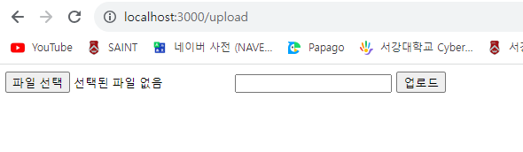

# Node.js 교과서 6장 요약
## *익스프레스 웹 서버 만들기*
- - -


## 6.1 익스프레스 프로젝트 시작하기

본격적으로 익스프레스 프로젝트를 시작하기 앞서, 항상 패키지 생성과 동시에 `package.json`을 먼저 생성한다.

**console**
```
PS D:\공부\Javascript\Study_Node.js\Codes\chapter06\learn-express> npm init
...
```

**package.json**
```
{
  "name": "learn-express",
  "version": "0.0.1",
  "description": "Learning about express package",
  "main": "app.js",
  "scripts": {
    "start": "nodemon app"
  },
  "author": "Yushin Kim",
  "license": "ISC",
  "dependencies": {
    "express": "^4.18.2"
  },
  "devDependencies": {
    "nodemon": "^3.0.1"
  }
}
```

여기서 `start` 명령어에 `nodemon app`이라는 동작을 할당했다. 이는 `nodemon`으로 `app.js`를 실행한다는 의미이다. 서버 코드에 수정 사항이 생길 때마다 `nodemon` 모듈로 서버를 재시작할 수 있다. 배포된 뒤에는 서버 코드가 빈번하게 변경될 일이 없으므로 `nodemon`은 개발 단계에서만 사용이 권장된다.

그 다음으로는 필요한 패키지들을 설치한다.

**console**
```
PS D:\공부\Javascript\Study_Node.js\Codes\chapter06\learn-express> npm i express

added 58 packages, and audited 59 packages in 3s

8 packages are looking for funding
  run `npm fund` for details

found 0 vulnerabilities
PS D:\공부\Javascript\Study_Node.js\Codes\chapter06\learn-express> npm i -D nodemon 

added 33 packages, and audited 92 packages in 3s

11 packages are looking for funding
  run `npm fund` for details

found 0 vulnerabilities
```

이제 서버 역할을 할 app.js의 코드를 다음과 같이 작성한다.

**app.js**
```
const express = require("express");

const app = express();
app.set("port", process.env.PORT || 3000);

app.get("/", (req, res) => {
    res.send("Hello, Express");
});

app.listen(app.get("port"), () => {
    console.log(`${app.get("port")}번 포트에서 대기 중`);
});
```

`Express` 모듈을 실행해 객체를 `app` 변수에 할당했다. 익스프레스 내부에 `http` 모듈이 내장되어 있으므로 서버의 역할을 할 수 있다.

`app.set("port", [port number])`로 서버가 실행될 포트를 설정할 수 있다. `process.env` 객체에 `PORT` 속성이 있다면 그 값을 우선 사용하고, 없다면 3000번 포트를 할당하도록 인수를 전달했다. 이런 식으로 `app.set([key], [value])`를 이용해서 데이터를 저장할 수 있으며, 나중에 데이터를 `app.get([key])`로 가져올 수 있다.

`app.get([key])`는 데이터를 가져오는 메소드이지만, `app.get([address], [router])`는 특정 주소에 대한 `GET` 요청이 들어올 때 어떤 동작을 할지 설정하는 메소드이다. 라우터 함수는 이전 장의 서버 프로그램 작성 시와 같은 형태로 작성하면 된다. 이 외에도 `POST` 요청을 위한 `app.post`, `PUT` 요청을 위한 `app.put`, `PATCH` 요청을 위한 `app.patch`, `DELETE` 요청을 위한 `app.delete`, `OPTIONS` 요청을 위한 `app.options` 메소드가 존재한다.

익스프레스에서는 `res.write`나 `res.end` 대신 `res.send`를 사용하면 된다.

`listen` 방식은 `http` 모듈로 구현한 웹 서버와 동일하다.

이제 서버를 시작한다.

**console**
```
PS D:\공부\Javascript\Study_Node.js\Codes\chapter06\learn-express> npm start

> learn-express@0.0.1 start
> nodemon app

[nodemon] 3.0.1
[nodemon] to restart at any time, enter `rs`
[nodemon] watching path(s): *.*
[nodemon] watching extensions: js,mjs,cjs,json
[nodemon] starting `node app.js`
3000번 포트에서 대기 중
```


위 예제에서는 단순한 문자열로 응답했지만, HTML로 응답해야 하는 경우도 있다. 이때는 `res.sendFile` 메소드를 사용하면 된다. 이때는 파일의 경로를 `path` 모듈을 사용해서 지정해야 한다. 예제는 다음과 같다.

**index.html**
```
<!DOCTYPE html>
<html lang="en">
<head>
    <meta charset="UTF-8">
    <meta name="viewport" content="width=device-width, initial-scale=1.0">
    <title>익스프레스 서버</title>
</head>
<body>
    <h1>익스프레스 서버</h1>
    <p>It works!</p>
</body>
</html>
```

**app.js**
```
const express = require("express");
const path = require("path");

const app = express();
app.set("port", process.env.PORT || 3000);

app.get("/", (req, res) => {
    //res.send("Hello, Express");
    res.sendFile(path.join(__dirname, "/html/index.html"));
});

app.listen(app.get("port"), () => {
    console.log(`${app.get("port")}번 포트에서 대기 중`);
});
```

`nodemon` 패키지를 사용하고 있으므로 서버를 종료하지 않아도 자동으로 서버 프로그램의 변경 사항이 반영된다.
- - -


## 6.2 자주 사용하는 미들웨어

`미들웨어(middleware)`는 요청과 응답의 중간에 위치하는 것으로, 익스프레스의 핵심이다. 요청과 응답을 조작해 기능을 추가하기도 하고, 나쁜 요청을 걸러내기도 한다.

미들웨어는 `app.use([middleware])`처럼 사용된다. 다음은 익스프레스 서버에 미들웨어를 연결하는 예제이다.

**app.js**
```
const express = require("express");
const path = require("path");

const app = express();
app.set("port", process.env.PORT || 3000);

app.use((req, res, next) => {
    console.log("모든 요청에 다 실행됩니다.");
    next();
});
app.get("/", (req, res, next) => {
    console.log("GET / 요청에서만 실행됩니다.");
    next();
}, (req, res) => {
    throw new Error("에러는 에러 처리 미들웨어로 갑니다.");
});

app.use((err, req, res, next) => {
    console.error(err);
    res.status(500).send(err.message);
});

app.listen(app.get("port"), () => {
    console.log(`${app.get("port")}번 포트에서 대기 중`);
});
```

간단히 `app.use`의 매개변수로 `req`, `res`, `next`를 전달하면 된다. 미들웨어는 위에서부터 아래로 순서대로 실행되면서 요청과 응답 사이에 특별한 기능을 추가할 수 있다. 세 번째 매개변수인 `next`가 다음 미들웨어로 넘어가는 함수이다. `next()`를 실행하지 않으면 다음 미들웨어가 실행되지 않는다.

주소를 `use`의 첫 번째 인수로 넣어주지 않으면 모든 요청에 대해 미들웨어가 실행되고, 주소를 넣으면 해당 요청에서만 실행된다.

**미들웨어가 실행되는 경우**
| 메소드 형태 | 기능 |
| :-- | :-- |
| app.use([middleware]) | 모든 요청에서 미들웨어 실행 |
| app.use([path], [middleware]) | 해당 주소로 시작하는 요청에서 미들웨어 실행 |
| app.pose([path], [middleware]) | 해당 주소로 시작하는 POST 요청에서 미들웨어 실행 |

`app.use`나 `app.get`과 같은 것들을 라우터라고 부르는데, 여기에 미들웨어를 여러 개 장착할 수 있다. 위 예제에서도 `app.get`에 미들웨어가 두 개 연결되어 있다. 그러나 단순히 연결만 된 것으론 부족하고 `next()`를 호출해야 다음 미들웨어를 실행할 수 있다.

에러 처리 미들웨어는 매개변수가 `err`, `req`, `res`, `next`로 네 개이다. 다중정의되어 있기 때문에 모든 매개변수를 사용하지 않더라도 매개변수를 반드시 네 개 전달해야 한다. 특별한 경우가 아니라면 에러 처리 미들웨어는 가장 아래에 위치한다.

`res.send`를 사용하기 전에 `res.status`로 HTTP 상태 코드를 지정할 수 있다.

이렇게 미들웨어를 통해 요청과 응답에 다양한 기능을 추가할 수 있다. 이미 많은 사람들이 유용한 기능들을 패키지로 만들어 놓았으므로 실무에 자주 사용하는 패키지들을 설치한다.

**console**
```
PS D:\공부\Javascript\Study_Node.js\Codes\chapter06\learn-express> npm i morgan cookie-parser express-session dotenv

added 12 packages, and audited 104 packages in 5s

12 packages are looking for funding
  run `npm fund` for details

found 0 vulnerabilities
```

`dotenv`는 `process.env`를 관리하기 위해 설치한 것이고, 나머지 패키지는 모두 미들웨어이다.

이제 기존의 서버 코드의 앞부분을 다음과 같이 수정하고, `.env` 파일도 생성한다.

**app.js**
```
const express = require("express");
const morgan = require("morgan");
const cookieParser = require("cookie-parser");
const session = require("express-session");
const dotenv = require("dotenv");
const path = require("path");

dotenv.config();
const app = express();
app.set("port", process.env.PORT || 3000);

app.use(morgan("dev"));
app.use("/", express.static(path.join(__dirname, "public")));
app.use(express.json());
app.use(express.urlencoded({ extended: false }));
app.use(cookieParser(process.env.COOKIE_SECRET));
app.use(session({
    resave: false,
    saveUninitialized: false,
    secret: process.env.COOKIE_SECRET,
    cookie: {
        httpOnly: true,
        secure: false,
    },
    name: "session-cookie",
}));

app.use((req, res, next) => {
    console.log("모든 요청에 다 실행됩니다.");
    next();
});
...
```

**.env**
```
COOKIE_SECRET=cookiesecret
```

설치했던 패키지들을 불러온 뒤 패키지의 미들웨어들을 `app.use`에 연결하였다.

`dotenv` 패키지는 `.env` 파일을 읽어서 `process.env`로 만든다. 그러므로 `process.env.COOKIE_SECRET`에 `cookiesecret` 값이 할당된다. `key=value` 형식으로 추가하면 된다. 비밀 키들을 소스코드에 노출하지 않고 별도의 파일로 관리함으로써 보안과 설정의 편의를 누릴 수 있다. 그러므로 `.env` 파일이 유출되지 않게 주의해야 한다.

앞으로는 추가된 미들웨어들에 대해 알아본다.


### 6.2.1 morgan

`morgan` 연결 후 localhost:3000에 접속하면 추가적인 로그가 생긴다.

**console**
```
PS D:\공부\Javascript\Study_Node.js\Codes\chapter06\learn-express> npm start

> learn-express@0.0.1 start
> nodemon app

[nodemon] 3.0.1
[nodemon] to restart at any time, enter `rs`
[nodemon] watching path(s): *.*
[nodemon] watching extensions: js,mjs,cjs,json
[nodemon] starting `node app.js`
3000번 포트에서 대기 중
모든 요청에 다 실행됩니다.
GET / 요청에서만 실행됩니다.
Error: 에러는 에러 처리 미들웨어로 갑니다.
    at D:\공부\Javascript\Study_Node.js\Codes\chapter06\learn-express\app.js:36:11
    at Layer.handle [as handle_request] (D:\공부\Javascript\Study_Node.js\Codes\chapter06\learn-express\node_modules\express\lib\router\layer.js:95:5)
    at next (D:\공부\Javascript\Study_Node.js\Codes\chapter06\learn-express\node_modules\express\lib\router\route.js:144:13)
    at D:\공부\Javascript\Study_Node.js\Codes\chapter06\learn-express\app.js:34:5
    at Layer.handle [as handle_request] (D:\공부\Javascript\Study_Node.js\Codes\chapter06\learn-express\node_modules\express\lib\router\layer.js:95:5)
    at next (D:\공부\Javascript\Study_Node.js\Codes\chapter06\learn-express\node_modules\express\lib\router\route.js:144:13)
    at Route.dispatch (D:\공부\Javascript\Study_Node.js\Codes\chapter06\learn-express\node_modules\express\lib\router\route.js:114:3)
    at Layer.handle [as handle_request] (D:\공부\Javascript\Study_Node.js\Codes\chapter06\learn-express\node_modules\express\lib\router\layer.js:95:5)
    at D:\공부\Javascript\Study_Node.js\Codes\chapter06\learn-express\node_modules\express\lib\router\index.js:284:15
    at Function.process_params (D:\공부\Javascript\Study_Node.js\Codes\chapter06\learn-express\node_modules\express\lib\router\index.js:346:12)
GET / 500 17.991 ms - 50
```

콘솔에 나오는 `GET / 500 17.991 ms - 50`은 `morgan` 미들웨어에 의해 출력되는 것이다. 요청과 응답에 대한 정보를 콘솔에 기록한다. 각각 `[HTTP 메소드] [주소] [HTTP 상태 코드] [응답 속도] - [응답 바이트]`를 의미한다.

`morgan` 미들웨어는 `app.use(morgan("dev"))`와 같이 사용한다. 인수로는 `dev` 대신 `combined`, `common`, `short`, `tiny` 등을 넣을 수 있다. 인수가 바뀌면 로그가 달라진다.


### 6.2.2 static

`static` 미들웨어는 정적인 파일들을 제공하는 라우터 역할을 한다. `express` 객체에서 기본적으로 제공하기 때문에 따로 설치할 필요가 없다. `app.use([requested path], express.static([actual path]))`와 같은 형태로 사용한다.

이 미들웨어는 클라이언트가 요청한 경로에 대해 실제 경로를 매핑한다고 보면 된다. 이것을 활용하여 제3자가 서버의 구조를 쉽게 파악할 수 없게 하여 보안에 도움이 된다.

또한, 정적 파일들을 알아서 제공해주기 때문에 `fs.readFile`로 파일을 직접 읽어서 전송할 필요가 없다.


### 6.2.3 body-parser

`body-parser`는 요청의 본문에 있는 데이터를 해석해서 `req.body`로 만들어주는 미들웨어이다. 보통 폼 데이터나 AJAX 요청의 데이터를 처리한다. 단, 멀티파트(이미지, 동영상, 파일) 데이터는 처리하지 못한다. 이는 `multer` 모듈을 사용해서 해결할 수 있다.

```
app.use(express.json());
app.use(express.urlencoded({ extended: false }));
```
위와 같이 사용할 수 있다. 이 미들웨어 역시 `express` 객체에서 기본적으로 제공하고 있다.

익스프레스는 `JSON`과 `URL-encoded` 형식의 데이터 외에도 `Raw`, `Text` 형식의 데이터를 추가로 해석할 수 있다. `Raw`는 요청의 본문이 버퍼 데이터일 때, `Text`는 텍스트 데이터일 때 해석하는 미들웨어이다. `app.use(express.raw())`, `app.use(express.text())`와 같이 사용할 수 있다.

`JSON`은 JSON 형식의 데이터 전달 방식이고, `URL-encoded`는 주소 형식의 데이터 전달 방식이다. 폼 전송은 `URL-encoded` 방식을 주로 사용한다. `urlencoded` 메소드의 `{ extended: false }` 옵션은 false일 경우 노드의 `querystring` 모듈을 사용해 쿼리스트링을 해석하고, true일 경우 `qs` 모듈을 사용해 쿼리스트링을 해석한다. `qs` 모듈은 별도의 설치가 필요하다는 점에 유의해야 한다.

이전 절에서 요청의 본문을 전달받기 위해 `req.on("data")`, `req.on("end")` 등의 스트림을 사용해야 했던 것에 반해 `body-parser`는 내부적으로 스트림을 처리해 `req.body`에 추가해주기 때문에 매우 편리하다.

예를 들어 본문에 JSON 형식으로 `{ name: "yushin", age: "23" }`을 보냈다면 이를 직접 파싱할 필요 없이 `req.body`에 자동적으로 기록된다.


### 6.2.4 cookie-parser

`cookie-parser`는 요청과 함께 전송된 쿠키를 해석해 `req.cookies` 객체로 만든다. `app.use(cookieParser([secret key]))`와 같이 사용한다. 예를 들어 `name=yushin` 쿠키를 보냈다면 `req.cookies`는 `{ name: "yushin" }`이 되는 것이다. 유효 기간이 지난 쿠키도 알아서 처리한다.

첫 번째 인수로 전달하는 비밀 키는 해당 쿠키가 내 서버로부터 생성되었음을 검증하는 데 사용된다. 비밀 키를 통해 만들어진 서명이 쿠키 뒤에 붙어 `name=yushin.sign`과 같은 모양이 되며, 서명된 쿠키는 `req.signedCookies` 객체에 저장된다.

`cookie-parser`가 쿠키를 생성할 때 쓰이는 것은 아니기 때문에 쿠키를 생성/삭제하려면 `res.cookie`, `res.clearCookie` 메소드를 사용해야 한다. `res.cookie([key], [value], [option])` 형식으로 사용한다. 옵션은 이전 절에서 살펴본 쿠키 옵션과 동일하며, `domain`, `expires`, `httpOnly`, `maxAge`, `path`, `secure` 등이 있다.

```
res.cookie("name", "yushin", {
  expires: new Date(Date.now() + 900000),
  httpOnly: true,
  secure: true,
});

res.clearCookie("name", "yushin", { httpOnly: true, secure: true });
```

위와 같이 사용하며, 쿠키를 삭제하려면 키, 값 및 옵션까지 모두 정확히 일치해야 한다. 단, `expires`나 `maxAge` 옵션은 일치할 필요가 없다.

옵션 중에는 `signed`라는 옵션이 있는데, 이를 true로 설정하면 쿠키 뒤에 서명이 붙는다. 서명을 붙이면 나의 서버로부터 쿠키가 생성되었다는 것을 검증할 수 있으므로 대부분의 경우 활성화하는 것이 좋다. 서명을 위한 비밀 키는 `cookieParser` 미들웨어에 인수로 넣은 `process.env.COOKIE_SECRET`이 된다.


### 6.2.5 express-session

`express-session`은 세션 관리용 미들웨어이다. 로그인 등의 이유로 세션을 구현하거나 특정 사용자를 위한 데이터를 임시적으로 저장할 때 유용하다. 세션은 사용자별로 `req.session` 객체 안에 유지된다.

```
app.use(session({
  resave: false,
  saveUninitialized: false,
  secret: process.env.COOKIE_SECRET,
  cookie: {
    httpOnly: true,
    secure: false,
  },
  name: "session-cookie",
}));
```

현재 어떤 버전의 `express-session`을 사용하고 있는지 모른다면 `cookie-parser` 미들웨어 뒤에 세션 코드를 놓는 것이 안전하다.

`express-session`은 인수로 세션에 대한 설정을 받는다. `resave`는 요청이 올 때 세션에 수정 사항이 생기지 않더라도 세션을 다시 저장할 것인지 설정하는 것이고, `saveUninitialized`는 세션에 저장할 내역이 없더라도 처음부터 세션을 생성할지 설정하는 것이다.

`express-session`은 세션 관리 시 클라이언트에 세션 쿠키를 보낸다. 안전하게 쿠키를 전송하기 위해 서명을 추가해야 하고, 그러므로 `secret`의 값이 필요하다. `cookie-parser`의 `secret` 값과 같게 설정하는 것이 좋다. 세션 쿠키의 이름은 `name` 옵션에 설정한다. 기본값은 `connect.sid`이다.

`cookie` 옵션은 세션 쿠키에 대한 설정이다. 일반적인 쿠키 옵션이 모두 제공된다. 현재는 `httpOnly`를 true로 설정해 클라이언트에서 쿠키를 확인하지 못하도록 하고, `secure`는 false로 설정해 https가 아닌 환경에서도 사용할 수 있게 했지만 실제 배포 시에는 https를 적용하고 `secure`도 true로 설정하는 것이 좋다.

예제 코드에는 없지만, `store`라는 옵션도 존재한다. 현재는 메모리 기반의 저장소를 사용하고 있지만, 배포 시에는 `store`에 데이터베이스를 연결해 세션을 유지하는 것이 좋다.

```
req.session.name = "yushin";    // 세션 등록
req.sessionID;                  // 세션 아이디 확인
req.session.destroy();          // 세션 모두 삭제
```

`express-session`으로 만들어진 `req.session` 객체에 값을 대입하거나 삭제해서 세션을 변경할 수도 있다. 세션을 일괄 삭제하려면 `req.session.destroy` 메소드를 호출하면 된다. 세션 아이디는 `req.sessionID` 또는 `req.session.id`로 확인할 수 있다. `req.session.save` 메소드로 세션을 강제 저장할 수 있지만 일반적으로 요청이 끝날 때 자동으로 호출되므로 직접 호출할 일은 거의 없다.


`express-session`에서 서명한 쿠키 앞에는 `s:`이 붙는다. 실제로는 `encodeURIComponent` 함수가 실행되어 `s%3A`가 된다. 그 뒷부분이 실제 암호화된 쿠키 내용이다.


### 6.2.6 미들웨어의 특성 활용하기

```
app.use((req, res, next) => {
    console.log("모든 요청에 다 실행됩니다.");
    next();
});
```

**미들웨어**는 `req`, `res`, `next`를 매개변수로 갖는 **함수**(에러 처리 미들웨어만 예외적으로 `err`, `req`, `res`, `next`)이다. `app.use`나 `app.get`, `app.post` 등으로 장착한다. 특정한 주소에 대한 요청에만 미들웨어가 실행되게 하려면 미들웨어를 장착할 메소드의 첫 번째 인수로 주소를 전달하면 된다.

```
app.use(
  morgan("dev"),
  express.static("/", path.join(__dirname, "public")),
  express.json(),
  express.urlencoded({ extended: false }),
  cookieParser(process.env.COOKIE_SECRET),
);
```

위와 같이 동시에 여러 개의 미들웨어를 장착할 수도 있다. 물론 다음 미들웨어로 넘어가려면 반드시 `next()`를 호출해야 한다. 그러나 위에 명시된 미들웨어들은 내부적으로 `next()`를 호출하고 있으므로 연달아 장착할 수 있다.

`next()`를 호출하지 않는 미들웨어는 `res.send`나 `res.sendFile` 등의 메소드로 응답을 보내야 한다. `express.static`과 같은 미들웨어는 정적 파일을 제공할 때 `next` 대신 `res.sendFile` 메소드로 응답을 보내도록 구현되어 있으므로, 정적 파일을 제공하는 상황에선 뒤에 장착된 미들웨어들이 실행되지 않는다.

이처럼 장착 순서에 따라 어떤 미들웨어는 실행되지 않을 수도 있다는 점에 주의한다. 만약 `next()`도 호출하지 않고, 응답도 보내지 않으면 클라이언트는 응답을 기다리다가 timeout 될 것이다.

만약 `next`에 인수를 넣는다면 특수한 동작을 한다. `route`라는 문자열을 넣으면 다음 라우터의 미들웨어로 바로 이동하고, 그 외의 인수를 넣는다면 에러 처리 미들웨어로 바로 이동한다. 이때의 인수는 에러 처리 미들웨어의 `err` 매개변수가 된다.

미들웨어 간에 데이터를 전달하는 방법도 있다. 세션을 사용한다면 `res.session` 객체에 데이터를 넣어도 되지만, 이는 미들웨어 종료 이후에도 세션이 유지되는 동안 데이터가 계속 존재한다는 단점이 존재한다. 만약 요청이 끝날 때까지만 데이터를 유지하고 싶다면 `res.locals` 객체에 데이터를 넣어두면 된다.

```
app.use((req, res, next) => {
  res.locals.data = "임시 데이터";  // 데이터 넣기
  next();
}, (req, res, next) => {
  console.log(res.locals.data);    // 데이터 받기
  next();
});
```

위와 같이 코드를 작성하면 현재 요청이 처리되는 동안에만 `res.locals` 객체를 통해 데이터를 교환할 수 있다. 새로운 요청이 들어오면 `res.locals`는 초기화된다.

이와 비슷하게 `app.set`을 통해 데이터를 저장하고, `req.app.get`으로 어디서든지 데이터를 가져올 수도 있다. 그러나 이는 익스프레스에서 전역적으로 사용되기 때문에 임시적인 데이터를 교환하기엔 적절하지 않고, 앱 전체의 설정을 공유할 때 사용하면 된다.

미들웨어를 사용할 때 유용하게 쓰이는 패턴이 하나 있는데, 그 코드는 다음과 같다.

```
app.use(morgan("dev"));
// 또는
app.use((req, res, next) => {
  morgan("dev")(req, res, next);
});
```

이 패턴은 기존 미들웨어의 기능을 확장할 수 있기 때문에 유용하다. 예를 들어 다음과 같이 분기 처리를 할 수도 있다.

```
app.use((req, res, next) => {
  if (process.env.NODE_ENV === "production") {
    morgan("combined")(req, res, next);
  }
  else {
    morgan("dev")(req, res, next);
  }
});
```

이는 즉 배포판이면 `morgan` 미들웨어를 `combined` 모드로 실행하고, 그게 아니라면 `dev` 모드로 실행하는 것을 의미한다. 이것이 기능 확장의 한 예이다.


### 6.2.7 multer

`multer`는 이미지, 동영상 등을 비롯한 여러 가지 파일을 멀티파트 형식으로 업로드할 때 사용하는 미들웨어이다. 멀티파트 형식이란 다음과 같이 `enctype`이 `multipart/form-data`인 폼을 통해 업로드하는 데이터의 형식을 의미한다.

다음과 같은 폼이 있다면 멀티파트 형식으로 데이터를 업로드할 수 있다.

**multipart.html**
```
<form action="/upload" method="post" enctype="multipart/form-data">
    <input type="file" name="image"/>
    <input type="text" name="title"/>
    <button type="submit">업로드</button>
</form>
```

위와 같이 폼으로 업로드하는 파일은 `body-parser`로는 처리할 수 없고 직접 파싱하기도 어려우므로 `multer` 미들웨어를 따로 사용하면 편리하다. 다음과 같이 미들웨어를 설치한다.

**console**
```
PS D:\공부\Javascript\Study_Node.js\Codes\chapter06\learn-express> npm i multer

added 19 packages, and audited 123 packages in 2s

13 packages are looking for funding
  run `npm fund` for details

found 0 vulnerabilities
```

`multer` 패키지 안에는 여러 종류의 미들웨어가 존재한다. 기본적인 설정부터 알아본다.

```
const multer = require("multer");

const upload = multer({
  storage: multer.diskStorage({
    destination(req, file, done) {
      done(null, "uploads/");
    },
    filename(req, file, done) {
      const ext = path.extname(file.originalname);
      done(null, path.basename(file.originalname, ext) + Date.now() + ext);
    },
  }),
  limits: { fileSize: 5 * 1024 * 1024 },
});
```

`multer` 함수의 인수로 설정을 전달한다. `storage` 속성에는 어디에(`destination`), 어떤 이름으로(`filename`) 저장할지를 명시하였다. `destination`과 `filename` 함수의 `req` 매개변수에는 요청에 대한 정보가, `file` 객체에는 업로드한 파일에 대한 정보가 있다. `done` 매개변수는 함수이므로, 첫 번째 인수로는 에러가 있을 경우 에러를 전달하고 두 번째 인수로는 실제 경로나 파일 이름을 전달하면 된다. `req`나 `file`의 데이터를 가공해서 `done`으로 넘기는 형식이다.

위 예시 설정은 `uploads`라는 디렉터리에 `[파일명][현재시간].[확장자]` 형식의 파일명으로 업로드하고 있다. 현재 시간을 넣어주는 이유는 파일명이 겹치는 것을 방지하기 위함이다.

`limits` 속성에는 업로드에 대한 제한 사항을 설정할 수 있으며, 파일 사이즈(`fileSize`, 바이트 단위)는 5MB로 제한하였다. 위 설정을 실제로 활용하려면 서버에 `uploads` 디렉터리가 반드시 존재해야 한다. 직접 만들어주거나 다음과 같이 `fs` 모듈을 사용하여 서버 시작 시 생성한다.

```
const fs = require("fs");

try {
  fs.readdirSync("uploads");
} catch (error) {
  console.error("uploads 디렉터리가 없어 생성합니다.");
  fs.mkdirSync("uploads");
}
```

설정이 끝나면 `upload` 변수에 다양한 종류에 미들웨어가 들어가게 된다.

먼저 파일을 하나만 업로드하는 경우에는 `single` 미들웨어를 사용한다.

```
app.post("/upload", upload.single("image"), (req, res) => {
  console.log(req.file, req.body);
  res.send("ok");
})
```

`single` 미들웨어를 라우터 미들웨어 앞에 넣어두면 `multer` 설정에 따라 파일 업로드 후 `req.file` 객체가 생성된다. 인수는 `input` 태그의 `name`이나 폼 데이터의 `key`와 일치하게 전달하면 된다. 업로드 성공 시의 결과는 `req.file` 객체 안에 저장되어 있으며, `req.body`에는 파일이 아닌 데이터인 `title`이 저장되어 있다.

`req.file` 객체는 다음과 같이 생겼다.

```
{
  fieldname: "img",
  originalname: "nodejs.png",
  encoding: "7bit",
  mimetype: "image/png",
  destination: "uploads/",
  filename: "nodejs1514197844339.png",
  path: "uploads\\nodejs1514197844339.png",
  size: 53357
}
```

여러 파일을 업로드하는 경우 HTML의 `input` 태그에는 `multiple`을 사용하면 된다.

**multipart.html**
```
<form action="/upload" method="post" enctype="multipart/form-data">
    <input type="file" name="many" multiple/>
    <input type="text" name="title"/>
    <button type="submit">업로드</button>
</form>
```

이때 미들웨어는 `single` 대신 `array`를 사용한다.

```
app.post("/upload", upload.array("many"), (req, res) => {
  console.log(req.files, req.body);
  res.send("ok");
});
```

업로드 결과도 `req.file` 대신 `req.files` 배열에 저장되어 있다.

파일을 여러 개 업로드하지만, `input` 태그나 폼 데이터의 `key`가 다른 경우에는 `fields` 미들웨어를 사용한다.

**multipart.html**
```
<form action="/upload" method="post" enctype="multipart/form-data">
    <input type="file" name="image1"/>
    <input type="file" name="image2"/>
    <input type="text" name="title"/>
    <button type="submit">업로드</button>
</form>
```

`fields` 미들웨어의 인수로 `input` 태그의 `name`들을 각각 전달한다.

```
app.post("/upload",
  upload.fields([{ name: "image1" }, { name: "image2" }]),
  (req, res) => {
    console.log(req.files, req.body);
    res.send("ok");
  },
);
```

업로드 결과는 `req.files.image1`, `req.files.image2`에 각각 저장되어 있다.

특수한 경우이지만, 파일을 업로드하지 않고도 멀티파트 형식으로 업로드하는 경우가 있다. 이때는 `none` 미들웨어를 사용한다.

**multipart.html**
```
<form action="/upload" method="post" enctype="multipart/form-data">
    <input type="text" name="title"/>
    <button type="submit">업로드</button>
</form>
```

```
app.post("/upload", upload.none(), (req, res) => {
  console.log(req.body);
  res.send("ok");
});
```

파일을 업로드하지 않았으므로 `req.body`만 존재한다.

지금까지 살펴본 `multer`의 속성을 정리한 예제는 다음과 같다.

**app.js**
```
const express = require("express");
const morgan = require("morgan");
const cookieParser = require("cookie-parser");
const session = require("express-session");
const dotenv = require("dotenv");
const path = require("path");

dotenv.config();
const app = express();
app.set("port", process.env.PORT || 3000);

app.use(morgan("combined"));
app.use("/", express.static(path.join(__dirname, "public")));
app.use(express.json());
app.use(express.urlencoded({ extended: false }));
app.use(cookieParser(process.env.COOKIE_SECRET));
app.use(session({
    resave: false,
    saveUninitialized: false,
    secret: process.env.COOKIE_SECRET,
    cookie: {
        httpOnly: true,
        secure: false,
    },
    name: "session-cookie",
}));

const multer = require("multer");
const fs = require("fs");

try {
    fs.readdirSync("uploads");
} catch (error) {
    console.error("uploads 디렉터리가 존재하지 않으므로 생성합니다.");
    fs.mkdirSync("uploads");
}

const upload = multer({
    storage: multer.diskStorage({
        destination(req, file, done) {
            done(null, "uploads/");
        },
        filename(req, file, done) {
            const ext = path.extname(file.originalname);
            done(null, path.basename(file.originalname, ext) + Date.now() + ext);
        },
    }),
    limits: { fileSize: 5 * 1024 * 1024 },
});

app.get("/upload", (req, res) => {
    res.sendFile(path.join(__dirname, "html/multipart.html"));
});

app.post("/upload", upload.single("image"), (req, res) => {
    console.log(req.file);
    res.send("ok");
});

app.use((req, res, next) => {
    console.log("모든 요청에 다 실행됩니다.");
    next();
});
app.get("/", (req, res, next) => {
    console.log("GET / 요청에서만 실행됩니다.");
    next();
}, (req, res) => {
    throw new Error("에러는 에러 처리 미들웨어로 갑니다.");
});

app.use((err, req, res, next) => {
    console.error(err);
    res.status(500).send(err.message);
});

app.listen(app.get("port"), () => {
    console.log(`${app.get("port")}번 포트에서 대기 중`);
});
```

**multipart.html**
```
<form action="/upload" method="post" enctype="multipart/form-data">
    <input type="file" name="image"/>
    <input type="text" name="title"/>
    <button type="submit">업로드</button>
</form>
```



주소창에 **localhost:3000/upload**를 입력하여 접속한다. 여기서 파일을 선택하고 업로드해보겠다.


예제 코드는 파일명이 한글로 주어졌을 경우 문자가 깨지게 되어 다음과 같이 `multer`의 설정에서 `encodeURIComponent`로 파일명을 감쌌다.

```
const upload = multer({
    storage: multer.diskStorage({
        destination(req, file, done) {
            done(null, "uploads/");
        },
        filename(req, file, done) {
            const ext = path.extname(encodeURIComponent(file.originalname));
            done(null, path.basename(encodeURIComponent(file.originalname), ext) + Date.now() + ext);
        },
    }),
    limits: { fileSize: 5 * 1024 * 1024 },
});
```

**console**
```
{
  fieldname: 'image',
  originalname: 'ì\x8A¤í\x81¬ë¦°ì\x83· 2023-09-09 114233.png',
  encoding: '7bit',
  mimetype: 'image/png',
  destination: 'uploads/',
  filename: '%C3%AC%C2%8A%C2%A4%C3%AD%C2%81%C2%AC%C3%AB%C2%A6%C2%B0%C3%AC%C2%83%C2%B7%202023-09-09%201142331695972974586.png',
  path: 'uploads\\%C3%AC%C2%8A%C2%A4%C3%AD%C2%81%C2%AC%C3%AB%C2%A6%C2%B0%C3%AC%C2%83%C2%B7%202023-09-09%201142331695972974586.png',
  size: 1808921
}
::1 - - [29/Sep/2023:07:36:14 +0000] "POST /upload HTTP/1.1" 200 2 "http://localhost:3000/upload" "Mozilla/5.0 (Windows NT 10.0; Win64; x64) AppleWebKit/537.36 (KHTML, like Gecko) Chrome/117.0.0.0 Safari/537.36"
```


위와 같이 파일이 프로젝트 디렉터리의 uploads 디렉터리에 잘 저장된 것을 확인할 수 있다.
- - -


## 6.3 Router 객체로 라우팅 분리하기

이전 절에서 라우터를 만들 때는 요청 메소드와 주소별로 if문 분기 처리를 하느라 코드가 매우 복잡했다. 익스프레스는 라우팅을 깔끔하게 관리할 수 있어 이러한 단점이 해결된다.

**app.js**에서 `app.get` 같은 메소드가 라우터 부분이다. 라우터를 많이 연결하면 코드가 길어지므로 익스프레스에서는 라우터를 분리할 수 있는 방법을 제공한다.

다음과 같이 **routers** 디렉터리를 생성하고 그 안에 예제를 작성한다.

**index.js**
```
const express = require("express");

const router = express.Router();

// GET / 라우터
router.get("/", (req, res) => {
    res.send("Hello, Express");
});

module.exports = router;
```

**user.js**
```
const express = require("express");

const router = express.Router();

// GET /user 라우터
router.get("/user", (req, res) => {
    res.send("Hello, User");
});

module.exports = router;
```

이렇게 만들어진 라우터를 **app.js**에 연결한다. 또한, 에러 처리 미들웨어 위에 404 상태 코드를 응답하는 미들웨어를 하나 추가한다.

**app.js**
```
const express = require("express");
const morgan = require("morgan");
const cookieParser = require("cookie-parser");
const session = require("express-session");
const dotenv = require("dotenv");
const path = require("path");

dotenv.config();
const indexRouter = require("./routers");
const userRouter = require("./routers/user");
const app = express();
app.set("port", process.env.PORT || 3000);

...

app.use("/", indexRouter);
app.use("/user", userRouter);

app.use((req, res, next) => {
    res.status(404).send("Not Found");
})

app.use((err, req, res, next) => {
    console.error(err);
    res.status(500).send(err.message);
});

app.listen(app.get("port"), () => {
    console.log(`${app.get("port")}번 포트에서 대기 중`);
});
```

**index.js**와 **user.js**는 모양이 거의 비슷하지만 다른 주소의 라우터 역할을 하고 있다. `app.use`로 연결할 때의 차이 때문인데, `indexRouter`는 `use`의 `/`와 `get`의 `/`가 합쳐져 `GET /` 라우터가 되었고, `userRouter`는 `use`의 `/user`와 `get`의 `/`가 합쳐져 `GET /user` 라우터가 되었다. 이렇게 `app.use`로 연결할 때 주소가 합쳐진다.

이전 절에서 알아본 `next("route")` 기능은 라우터에 연결된 나머지 기능들을 건너뛰고 싶을 때 사용한다.

```
router.get("/", (req, res, next) => {
  next("route");
}, (req, res, next) => {
  console.log("실행되지 않습니다.");
  next();
}, (req, res, next) => {
  console.log("실행되지 않습니다.");
  next();
});

router.get("/", (req, res, next) => {
  console.log("실행됩니다.");
  res.send("Hello, Express");
});
```

위 예제처럼 같은 주소에 대한 라우터를 여러 개 만들어도 된다. 라우터가 몇 개이든 `next()`를 호출하면 다음 미들웨어가 실행된다. 단, 이때 `next("route")`를 호출하면 같은 라우터의 다음 미들웨어들은 건너뛰고 다음 라우터를 실행하는 것이다.

라우터의 주소에는 정규표현식을 비롯한 특수 패턴을 사용할 수 있다. 여러 가지 패턴이 존재하지만 **라우트 매개변수**라는 패턴만을 살펴본다.

```
router.get("/users/:id", (req, res) => {
  console.log(req.params, req.query);
});
```

주소에 있는 `:id`는 문자 그대로를 의미하는 것이 아니다. 이 주소는 `/users/1`이나 `/users/123`과 같은 주소들을 라우터가 처리할 수 있게 해준다. 이 방식의 장점은 `:id`에 해당하는 1이나 123을 조회할 수 있다는 점이며, 그 값들은 `req.params` 객체 안에 저장된다. 위 예제의 경우 값들은 `req.params.id`에 저장될 것이다. 만약 주소에 쿼리스트링이 포함된다면 그 정보는 `req.query` 객체에 저장된다.

단, 이 패턴을 사용할 때는 일반 라우터보다 뒤에 위치해야 한다. 다양한 라우터를 아우르는 와일드카드 역할을 하므로 일반 라우터보다는 뒤에 위치해야 다른 라우터들을 방해하지 않을 수 있다. 다음 예를 통해 설명한다.

```
router.get("/users/:id", (req, res) => {
  console.log("이 라우터만 실행됩니다.");
});

router.get("/users/like, (req, res) => {
  console.log("이 라우터는 실행되지 않습니다.);
});
```

사용자가 `/users/like` 주소로 요청을 보내더라도 라우트 매개변수 패턴을 사용한 라우터가 앞에 있으므로 주소의 `like`를 `id`로 인식하게 된다. 해당 라우터에는 `next`가 없으므로 `/users/like`에 대한 라우터는 실행될 수 없게 된다.

**app.js**에서 에러 처리 미들웨어 위에 넣어둔 미들웨어는 일치하는 라우터가 없을 때 404 상태 코드를 응답하는 역할을 한다. 이 미들웨어가 존재하지 않아도 익스프레스가 자체적으로 404 에러를 처리할 수 있지만 직접 연결해주는 것이 좋다.

```
app.use((req, res, next) => {
  res.status(404).send("Not Found");
});
```

이 미들웨어가 맨 앞에 존재한다면 모든 요청에 대해 404 상태 코드를 전송하기만 할 것이다. 이처럼 익스프레스를 활용한 서버에서는 미들웨어를 사용하는 위치가 중요하다.

마지막으로 라우터에서 자주 쓰이는 `app.route`, `router.route`에 대해 알아본다. 다음과 같이 주소는 같지만 메소드는 다른 코드가 있다고 가정한다.

```
router.get("/abc", (req, res) => {
  res.send("GET /abc");
});

router.post("/abc", (req, res) => {
  res.send("POST /abc");
});
```

위 코드를 다음과 같이 압축할 수 있다.

```
router.route("/abc")
  .get((req, res) => {
    res.send("GET /abc");
  })
  .post((req, res) => {
    res.send("POST /abc");
  });
```
- - -


## 6.4 req, res 객체 살펴보기

익스프레스의 `req`, `res` 객체는 `http` 모듈의 `req`, `res` 객체를 확장한 것이다. 그러므로 기존 `http` 모듈의 메소드도 사용할 수 있고, 익스프레스가 추가한 메소드나 속성을 사용할 수도 있다. 그러나 익스프레스의 메소드가 충분히 편리하기 때문에 기존 메소드는 잘 사용되지 않는다.

**req 객체의 메소드**
- `req.app`: `req` 객체를 통해 `app` 객체에 접근한다. `req.app.get("port")`와 같이 사용할 수 있다.
- `req.body`: `body-parser` 미들웨어가 만드는 요청의 본문을 해석한 객체이다.
- `req.cookies`: `cookie-parser` 미들웨어가 만드는 요청의 쿠키를 해석한 객체이다.
- `req.ip`: 요청의 ip 주소가 저장되어 있는 객체이다.
- `req.params`: 라우트 매개변수에 대한 정보가 저장되어 있는 객체이다.
- `req.query`: 쿼리스트링에 대한 정보가 저장되어 있는 객체이다.
- `req.signedCookies`: 서명된 쿠키들이 저장되어 있는 객체이다.
- `req.get([header name])`: 헤더의 값을 가져오고 싶을 때 사용하는 메소드이다.

**res 객체의 메소드**
- `res.app`: `res` 객체를 통해 `app` 객체에 접근한다.
- `res.cookie([key], [value], [option])`: 쿠키를 생성한다.
- `res.clearCookie([key], [value], [option])`: 쿠키를 삭제한다.
- `res.end()`: 데이터 없이 응답을 보낸다.
- `res.json(JSON)`: JSON 형식의 응답을 보낸다.
- `res.locals`: 하나의 요청 안에서 미들웨어 간 데이터를 교환하고 싶을 때 사용하는 객체이다.
- `res.redirect([address])`: 리다이렉트할 주소와 함께 응답을 보낸다.
- `res.render([view], [data])`: 템플릿 엔진을 렌더링해서 응답한다.
- `res.send([data])`: 데이터와 함께 응답을 보낸다.
- `res.sendFile([path])`: 경로에 위치한 파일로 응답을 보낸다.
- `res.set([header], [value])`: 응답의 헤더를 설정한다.
- `res.status([status code])`: 응답 시의 HTTP 상태 코드를 지정한다.

`req`나 `res` 객체의 메소드들은 다음과 같이 `메소드 체이닝(method chaining)`을 지원하는 경우가 많다. 메소드 체이닝을 활용하면 코드 양을 줄일 수 있다.

```
res
  .status(201)
  .cookie("test", "test")
  .redirect("/admin");
```

- - -


## 6.5 템플릿 엔진 사용하기

자바스크립트 없는 순수한 HTML은 정적인 언어이다. 정적인 기능만 사용할 수 있고 사용자가 기능을 직접 추가할 수 없다. HTML로 규칙이 있는 1000개의 데이터를 표현하고 싶다면 1000개를 모두 직접 코딩해야 한다. 반복문을 사용할 수 없기 때문이다.

템플릿 엔진은 자바스크립트를 사용하여 HTML을 렌더링할 수 있게 한다. 따라서 기존 HTML과는 문법이 약간 다를 수 있으며, 자바스크립트 문법이 포함되기도 한다.

이번 절에서는 대표적인 템플릿 엔진인 `퍼그(Pug)`와 `넌적스(Nunjucks)`에 대해 살펴본다. 앞으로의 예제는 넌적스를 사용한다.


### 6.5.1 퍼그(제이드)

`퍼그(Pug)` (또는 `제이드(Jade)`)는 Ruby 언어와 문법이 비슷하고 기본적으로 쉬운 문법을 갖고 있다는 것이 특징이다. 다음과 같이 퍼그를 설치하고, 익스프레스와 연결하기 위해 **app.js**를 수정한다.

**console**
```
PS D:\공부\Javascript\Study_Node.js\Codes\chapter06\learn-express> npm i pug

added 38 packages, and audited 161 packages in 3s

18 packages are looking for funding
  run `npm fund` for details

found 0 vulnerabilities
```

**app.js**
```
...
app.set("port", process.env.PORT || 3000);
app.set("views", path.join(__dirname, "views"));
app.set("view engine", "pug");
...
```

`views`는 템플릿 파일들이 위치한 디렉터리를 지정하는 것이다. `res.render` 메소드가 해당 디렉터리 기준으로 템플릿 엔진을 찾아서 렌더링한다. 예를 들어 `res.render("index")`라면 `views/index.pug`를 렌더링한다. `res.render("admin/main")`이라면 `views/admin/main.pug`를 렌더링한다.

`view engine`은 어떤 종류의 템플릿 엔진을 사용할 것인지를 나타낸다. 현재는 `pug`로 설정한 상태이다.

#### 6.5.1.1 HTML 표현

`pug`는 기존의 HTML과 다르게 화살 괄호(<, >)와 닫는 태그(</>)가 없다. 탭 또는 스페이스로만 태그의 부모-자식 관계를 규명한다. 탭의 개수나 스페이스 개수는 상관이 없으며, 모든 파일에 동일한 종류의 들여쓰기를 적용하면 된다. 자식 태그는 부모 태그보다 들여쓰기 개수가 더 많아야 한다는 것만 주의한다.

기본적인 퍼그와 HTML의 코드 차이점을 살펴본다.

**Pug**
```
doctype html
  html
    head
      title= title
      link(rel="stylesheet", href="/stylesheets/style.css")
```

**HTML**
```
<!DOCTYPE html>
<html>
  <head>
    <title>익스프레스</title>
    <link rel="stylesheet" href="/style.css"/>
  </head>
</html>
```

퍼그는 화살 괄호가 없으므로 태그의 속성도 조금 다르게 표현된다. 태그명 뒤에 소괄호로 태그들을 묶어 적는다.

속성 중 아이디와 클래스가 있는 경우엔 다음과 같이 표현할 수 있다. 특별하게 `div` 태그인 경우 `div`는 생략할 수 있다.

**Pug**
```
#login-button
.post-image
span#highlight
p.hidden.full
```

**HTML**
```
<div id="login-button"></div>
<div class="post-image"></div>
<span id="highlight"></span>
<p class="hidden full"></p>
```

HTML 텍스트는 다음과 같이 태그 또는 속성 뒤에 한 칸을 띄고 입력하면 된다.

**Pug**
```
p Welcome to Express
button(type="submit") 전송
```

**HTML**
```
<p>Welcome to Express</p>
<button type="submit">전송</button>
```

에디터에서 텍스트를 여러 줄 입력하고 싶다면 다음과 같이 파이프(`|`)를 넣는다. HTML 코드에서는 한 줄로 나온다.

**Pug**
```
p
  | 안녕하세요.
  | 여러 줄을 입력합니다.
  br
  | 태그도 중간에 넣을 수 있습니다.
```

**HTML**
```
<p>
  안녕하세요. 여러 줄을 입력합니다.
  <br/>
  태그도 중간에 넣을 수 있습니다.
</p>
```

`style`이나 `script` 태그로 CSS 또는 자바스크립트 코드를 작성하고 싶다면 다음과 같이 태그 뒤에 점(`.`)을 붙인다.

**Pug**
```
style.
  h1 {
    font-size: 30px;
  }
script.
  const message = "Pug";
  alert(message);
```

**HTML**
```
<style>
  h1 {
    font-size: 30px;
  }
</style>
<script>
  const message = "Pug";
  alert(message);
</script>
```


#### 6.5.1.2 변수

HTML과 다르게 자바스크립트 변수를 템플릿에 렌더링할 수 있다. `res.render`를 호출할 때 보내는 변수를 퍼그가 처리한다. **routes/index.js**의 코드를 보면 다음과 같은 부분이 있다.

```
router.get("/", (req, res, next) => {
    res.render("index", { title: "Express" });
});
```

`res.render([template], [variable object])`는 익스프레스가 `res` 객체에 추가한 템플릿 렌더링을 위한 메소드이다. **index.pug**를 HTML로 렌더링하면서 `{ title: "Express" }`라는 객체를 변수로 설정한다. `.pug` 확장자를 가진 파일의 `title` 부분이 모두 `Express`로 치환된다. 즉, HTML에서도 변수를 사용할 수 있게 된 것이다.

`res.render`의 두 번째 인수로 변수 객체를 넣는 대신 `res.locals` 객체를 사용해서 변수를 넣을 수도 있다.

```
router.get("/", (req, res, next) => {
  res.locals.title = "Express";
  res.render("index");
});
```

위와 같이 코드를 작성하면 템플릿 엔진이 `res.locals` 객체를 읽어서 변수를 설정한다. 이 방식을 사용하면 현재 라우터뿐만 아니라 같은 요청 내 실행되는 다른 미들웨어들에서도 `res.locals` 객체에 접근함으로써 데이터를 공유할 수 있다는 장점이 있다. 따라서 다른 미들웨어들에서 템플릿 엔진용 변수를 미리 설정할 수도 있다.

이제 퍼그에서 변수를 사용하는 방법을 살펴본다.

**Pug**
```
h1= title
p Welcome to #{title}
button(class=title, type="submit") 전송
input(placeholder=title + " 연습")
```

**HTML**
```
<h1>Express</h1>
<p>Welcome to Express</p>
<button class="title" type="submit">전송</button>
<input placeholder="Express 연습"/>
```

서버로부터 받은 변수는 다양한 방법으로 퍼그에서 사용할 수 있다. 변수를 텍스트로 사용하고 싶다면 태그 뒤에 `=`을 붙인 후 변수를 입력한다. 속성에도 `=`을 붙인 후 변수를 사용할 수 있다. 텍스트 중간에 변수를 넣고 싶다면 `#{variable}`을 사용하면 된다. 그러면 변수가 해당 위치에 치환된다. `#{}`와 `=` 기호 뒷부분은 자바스크립트로 해석하므로 `input` 태그의 예시처럼 자바스크립트 구문을 사용해도 된다.

`-`를 먼저 입력하면 그 뒤에 자바스크립트 구문을 작성할 수 있다. 여기에 변수를 선언하면 그 다음 줄부터 해당 변수를 사용할 수도 있다.

**Pug**
```
- const node = "Node.js"
- const js = "Javascript"
p #{node}와 #{js}
```

**HTML**
```
<p>Node.js와 Javascript</p>
```

퍼그는 기본적으로 변수의 특수 문자를 HTML 엔티티(entity)로 이스케이프(escape)한다. 이스케이프란 문법과 관련 없는 문자로 바꾸는 행위를 의미한다. 이스케이프를 원하지 않는다면 `=` 대신 `!=`을 사용하면 된다.

**Pug**
```
p= "<strong>이스케이프</strong>"
p!= "<string>이스케이프하지 않음</strong>"
```

**HTML**
```
<p>&lt;strong&gt;이스케이프&lt;/strong&gt;</p>
<p><strong>이스케이프하지 않음</strong></p>
```


#### 6.5.1.3 반복문

HTML과 다르게 반복문도 사용할 수 있다. 단, 반복 가능한 변수여야만 한다.

다음과 같이 `each`로 반복문을 돌릴 수 있다. `each` 대신 `for`를 써도 된다.

**Pug**
```
ul
  each fruit in ["사과", "배", "오렌지", "바나나", "복숭아"]
    li= fruit
```

**HTML**
```
<ul>
  <li>사과</li>
  <li>배</li>
  <li>오렌지</li>
  <li>바나나</li>
  <li>복숭아</li>
</ul>
```

반복문 사용 시 인덱스도 가져올 수 있다.

**Pug**
```
ul
  each fruit, index in ["사과", "배", "오렌지", "바나나", "복숭아"]
    li= (index + 1) + "번째 " + fruit
```

**HTML**
```
<ul>
  <li>1번째 사과</li>
  <li>2번째 배</li>
  <li>3번째 오렌지</li>
  <li>4번째 바나나</li>
  <li>5번째 복숭아</li>
</ul>
```


#### 6.5.1.4 조건문

조건문으로 편리하기 분기 처리를 할 수도 있다. `if`, `else if`, `else`를 사용할 수 있다. 다음은 로그인 여부에 따라 다르게 HTML을 렌더링하는 예시이다.

**Pug**
```
if isLoggedIn
  div 로그인 되었습니다.
else
  div 로그인이 필요합니다.
```

**HTML**
```
지원하지 않는다.
```

`case`문도 가능하다.

**Pug**
```
case fruit
  when "apple"
    p 사과입니다.
  when "banana"
    p 바나나입니다.
  when "orange"
    p 오렌지입니다.
  default
    p 사과도 바나나도 오렌지도 아닙니다.
```

**HTML**
```
지원하지 않는다.
```


#### 6.5.1.5 include

다른 퍼그나 HTML 파일을 삽입할 수도 있다. 헤더나 푸터, 내비게이션처럼 웹을 제작할 때 공통되는 부분을 따로 관리할 수 있기 때문에 페이지마다 동일한 HTML을 넣어야 하는 번거로움을 없앤다. `include [path]`와 같은 형태로 사용한다.

**Pug**

- **header.pug**
```
header
    a(href="/") Home
    a(href="/about") About 
```
- **footer.pug**
```
footer
    div 푸터입니다
```
- **main.pug**
```
include header
main
    h1 메인 파일
    p 다른 파일을 include할 수 있습니다.
include footer
```

**HTML**
```
<header>
  <a href="/">Home</a>
  <a href="/about">About</p>
</header>
<main>
  <h1>메인 파일</h1>
  <p>다른 파일을 include할 수 있습니다.</p>
</main>
<footer>
  <div>푸터입니다.</div>
</footer>
```


#### 6.5.1.6 extends와 block

레이아웃을 정할 수 있으며, 공통되는 레이아웃 부분을 따로 관리할 수 있다. `include`와도 함께 사용할 수 있다.

**Pug**

- **layout.pug**
```
doctype html 
html 
    head 
        title= title 
        link(rel="stylesheet", href="/style.css")
        block style 
    body 
        header 헤더입니다.
        block content 
        footer 푸터입니다.
        block script
```
- **body.pug**
```
extends layout

block content 
    main 
        p 내용입니다.

block script 
    script(src="/main.js")
```

**HTML**
```
<!DOCTYPE html>
<html>
  <head>
    <title>Express</title>
    <link rel="stylesheet" href="/style.css"/>
  </head>
  <body>
    <header>헤더입니다.</header>
    <main>
      <p>내용입니다.</p>
    </main>
    <footer>푸터입니다.</footer>
    <script src="/main.js"></script>
  </body>
</html>
```

레이아웃이 될 파일에는 공통된 마크업을 넣되, 페이지마다 달라지는 부분을 `block`으로 비워둔다. `block`은 여러 개 만들어도 된다. `block [block name]`과 같은 형태로 선언한다.

`block`이 되는 파일에서는 `extends` 키워드로 레이아웃 파일을 지정하고 `block` 부분을 작성한다. 이때 선언부보다 한 단계 더 들여쓰기 되어 있어야 한다. 나중에 익스프레스에서 `res.render("body")`를 사용하면 하나의 HTML로 합쳐 렌더링할 수 있다. `.pug` 확장자는 생략 가능하며 `block` 부분이 서로 합쳐진다.

이제 퍼그의 문법을 충분히 학습했으므로, 프로젝트 디렉터리의 `views` 디렉터리에 다음과 같이 **layout.pug**, **index.pug**, **error.pug**를 작성한다.

**layout.pug**
```
doctype html 
html 
    head 
        title= title 
        link(rel="stylesheet", href="/style.css")
    body 
        block content 
```

**index.pug**
```
extends layout 

block content 
    h1= title 
    p Welcome to #{title}
```

**error.pug**
```
extends layout 

block content 
    h1= message 
    h2= error.status 
    pre #{error.stack}
```

**index.pug**는 서버의 `res.render`로부터 `title`이라는 변수를 받아 렌더링한다. 여기서 작성된 `block content`는 `layout.pug`로 연결되어 레이아웃의 `block content` 부분을 채운다.

**error.pug**도 `block content` 부분이 `layout.pug`와 연결된다. `res.render`로부터 `message`와 `error` 변수를 받아 렌더링한다.


### 6.5.2 넌적스

`넌적스(Nunjucks)`는 퍼그의 HTML 문법 변화에 적응하기 힘들 경우 유용한 템플릿 엔진이다. HTML 문법을 그대로 사용하면서도 추가로 자바스크립트 문법을 사용할 수 있다.

다음과 같이 넌적스를 설치하고 **app.js**의 `view engine`을 퍼그 대신 넌적스로 교체한다.

**console**
```
PS D:\공부\Javascript\Study_Node.js\Codes\chapter06\learn-express> npm i nunjucks

added 3 packages, and audited 164 packages in 1s

18 packages are looking for funding
  run `npm fund` for details

found 0 vulnerabilities
```

**app.js**
```
...
const nunjucks = require("nunjucks");

dotenv.config();
const indexRouter = require("./routes");
const userRouter = require("./routes/user");

const app = express();
app.set("port", process.env.PORT || 3000);
app.set("view engine", "html");

nunjucks.configure("views", {
    express: app,
    watch: true,
});
...
```

퍼그와는 연결 방법이 다소 다르다. `configure`의 첫 번째 인수로 `view` 디렉터리의 경로를 전달하고, 두 번째 인수로는 옵션을 전달한다. 이때 `express` 속성에 `app` 객체를 연결한다. `watch` 옵션이 true이면 HTML 파일이 변경될 때 템플릿 엔진을 다시 렌더링한다.

파일은 `.pug`와 같은 특수한 확장자 대신 `.html`을 그대로 사용해도 된다. 넌적스임을 구분해야 한다면 `.njk`를 사용하면 된다. 단, `.njk` 확장자를 사용할 때는 **app.js**의 `view engine`도 `njk`로 바꾸어야 한다.

이제 위에서 살펴본 퍼그 예제와 같은 예제를 넌적스 문법으로 작성해 본다.


#### 6.5.2.1 변수

`res.render` 호출 시 보내는 변수를 넌적스가 처리한다. 다시 다음과 같은 코드를 확인해 보자.

```
router.get("/", (req, res, next) => {
    res.render("index", { title: "Express" });
});
```

**Nunjucks**
```
<h1>{{title}}</h1>
<p>Welcome to {{title}}</p>
<button class="{{title}}" type="submit">전송</button>
<input placeholder="Express 연습"/>
```

**HTML**
```
<h1>Express</h1>
<p>Welcome to Express</p>
<button class="title" type="submit">전송</button>
<input placeholder="Express 연습"/>
```

넌적스에서 변수는 `{{ }}`로 감싼다.

내부에서 변수를 사용할 수도 있다. 변수를 선언할 때는 ``을 사용한다.

**Nunjucks**
```


<p>{{node}}와 {{js}}</p>
```

**HTML**
```
<p>Node.js와 Javascript</p>
```

HTML을 이스케이프하고 싶지 않다면 `{{ [variable] | safe }}`를 사용한다.

**Nunjucks**
```
<p>{{"<strong>이스케이프</strong>"}}</p>
<p>{{"<strong>이스케이프하지 않음</strong>" | safe}}</p>
```

**HTML**
```
<p>&lt;strong&gt;이스케이프&lt;/strong&gt;</p>
<p><strong>이스케이프하지 않음</strong></p>
```


#### 6.5.2.2 반복문

넌적스에서는 특수한 문(statement)을 `` 안에 기술한다. 따라서 반복문도 해당 기호 안에 기술하면 된다. `for in`문과 `endfor`을 안에 기술하고 그 사이에 내용을 삽입한다.

**Nunjucks**
```
<ul>
  
  
  <li>{{item}}</li>
  
</ul>
```

**HTML**
```
<ul>
  <li>사과</li>
  <li>배</li>
  <li>오렌지</li>
  <li>바나나</li>
  <li>복숭아</li>
</ul>
```

반복문에서 인덱스를 사용하고 싶다면 `loop.index`라는 특수한 변수를 사용한다.

**Nunjucks**
```
<ul>
  
  
  <li>{{loop.index}}번째 {{item}}</li>
  
</ul>
```

**HTML**
```
<ul>
  <li>1번째 사과</li>
  <li>2번째 배</li>
  <li>3번째 오렌지</li>
  <li>4번째 바나나</li>
  <li>5번째 복숭아</li>
</ul>
```


#### 6.5.2.3 조건문

조건문은 ``, ``, ``로 이루어져 있다.