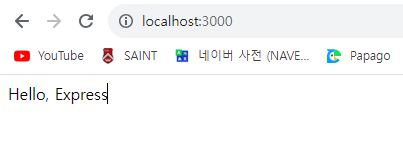

# Node.js 교과서 6장 요약
## *익스프레스 웹 서버 만들기*
- - -


## 6.1 익스프레스 프로젝트 시작하기

본격적으로 익스프레스 프로젝트를 시작하기 앞서, 항상 패키지 생성과 동시에 `package.json`을 먼저 생성한다.

**console**
```
PS D:\공부\Javascript\Study_Node.js\Codes\chapter06\learn-express> npm init
...
```

**package.json**
```
{
  "name": "learn-express",
  "version": "0.0.1",
  "description": "Learning about express package",
  "main": "app.js",
  "scripts": {
    "start": "nodemon app"
  },
  "author": "Yushin Kim",
  "license": "ISC",
  "dependencies": {
    "express": "^4.18.2"
  },
  "devDependencies": {
    "nodemon": "^3.0.1"
  }
}
```

여기서 `start` 명령어에 `nodemon app`이라는 동작을 할당했다. 이는 `nodemon`으로 `app.js`를 실행한다는 의미이다. 서버 코드에 수정 사항이 생길 때마다 `nodemon` 모듈로 서버를 재시작할 수 있다. 배포된 뒤에는 서버 코드가 빈번하게 변경될 일이 없으므로 `nodemon`은 개발 단계에서만 사용이 권장된다.

그 다음으로는 필요한 패키지들을 설치한다.

**console**
```
PS D:\공부\Javascript\Study_Node.js\Codes\chapter06\learn-express> npm i express

added 58 packages, and audited 59 packages in 3s

8 packages are looking for funding
  run `npm fund` for details

found 0 vulnerabilities
PS D:\공부\Javascript\Study_Node.js\Codes\chapter06\learn-express> npm i -D nodemon 

added 33 packages, and audited 92 packages in 3s

11 packages are looking for funding
  run `npm fund` for details

found 0 vulnerabilities
```

이제 서버 역할을 할 app.js의 코드를 다음과 같이 작성한다.

**app.js**
```
const express = require("express");

const app = express();
app.set("port", process.env.PORT || 3000);

app.get("/", (req, res) => {
    res.send("Hello, Express");
});

app.listen(app.get("port"), () => {
    console.log(`${app.get("port")}번 포트에서 대기 중`);
});
```

`Express` 모듈을 실행해 객체를 `app` 변수에 할당했다. 익스프레스 내부에 `http` 모듈이 내장되어 있으므로 서버의 역할을 할 수 있다.

`app.set("port", [port number])`로 서버가 실행될 포트를 설정할 수 있다. `process.env` 객체에 `PORT` 속성이 있다면 그 값을 우선 사용하고, 없다면 3000번 포트를 할당하도록 인수를 전달했다. 이런 식으로 `app.set([key], [value])`를 이용해서 데이터를 저장할 수 있으며, 나중에 데이터를 `app.get([key])`로 가져올 수 있다.

`app.get([key])`는 데이터를 가져오는 메소드이지만, `app.get([address], [router])`는 특정 주소에 대한 `GET` 요청이 들어올 때 어떤 동작을 할지 설정하는 메소드이다. 라우터 함수는 이전 장의 서버 프로그램 작성 시와 같은 형태로 작성하면 된다. 이 외에도 `POST` 요청을 위한 `app.post`, `PUT` 요청을 위한 `app.put`, `PATCH` 요청을 위한 `app.patch`, `DELETE` 요청을 위한 `app.delete`, `OPTIONS` 요청을 위한 `app.options` 메소드가 존재한다.

익스프레스에서는 `res.write`나 `res.end` 대신 `res.send`를 사용하면 된다.

`listen` 방식은 `http` 모듈로 구현한 웹 서버와 동일하다.

이제 서버를 시작한다.

**console**
```
PS D:\공부\Javascript\Study_Node.js\Codes\chapter06\learn-express> npm start

> learn-express@0.0.1 start
> nodemon app

[nodemon] 3.0.1
[nodemon] to restart at any time, enter `rs`
[nodemon] watching path(s): *.*
[nodemon] watching extensions: js,mjs,cjs,json
[nodemon] starting `node app.js`
3000번 포트에서 대기 중
```



위 예제에서는 단순한 문자열로 응답했지만, HTML로 응답해야 하는 경우도 있다. 이때는 `res.sendFile` 메소드를 사용하면 된다. 이때는 파일의 경로를 `path` 모듈을 사용해서 지정해야 한다. 예제는 다음과 같다.

**index.html**
```
<!DOCTYPE html>
<html lang="en">
<head>
    <meta charset="UTF-8">
    <meta name="viewport" content="width=device-width, initial-scale=1.0">
    <title>익스프레스 서버</title>
</head>
<body>
    <h1>익스프레스 서버</h1>
    <p>It works!</p>
</body>
</html>
```

**app.js**
```
const express = require("express");
const path = require("path");

const app = express();
app.set("port", process.env.PORT || 3000);

app.get("/", (req, res) => {
    //res.send("Hello, Express");
    res.sendFile(path.join(__dirname, "/html/index.html"));
});

app.listen(app.get("port"), () => {
    console.log(`${app.get("port")}번 포트에서 대기 중`);
});
```

`nodemon` 패키지를 사용하고 있으므로 서버를 종료하지 않아도 자동으로 서버 프로그램의 변경 사항이 반영된다.
- - -


## 6.2 자주 사용하는 미들웨어

`미들웨어(middleware)`는 요청과 응답의 중간에 위치하는 것으로, 익스프레스의 핵심이다. 요청과 응답을 조작해 기능을 추가하기도 하고, 나쁜 요청을 걸러내기도 한다.

미들웨어는 `app.use([middleware])`처럼 사용된다.